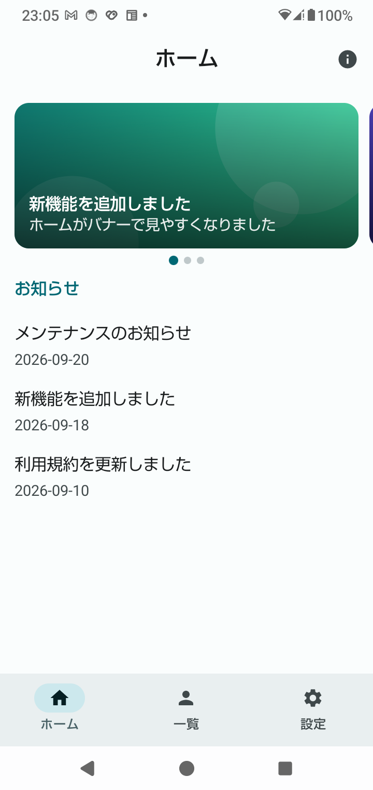
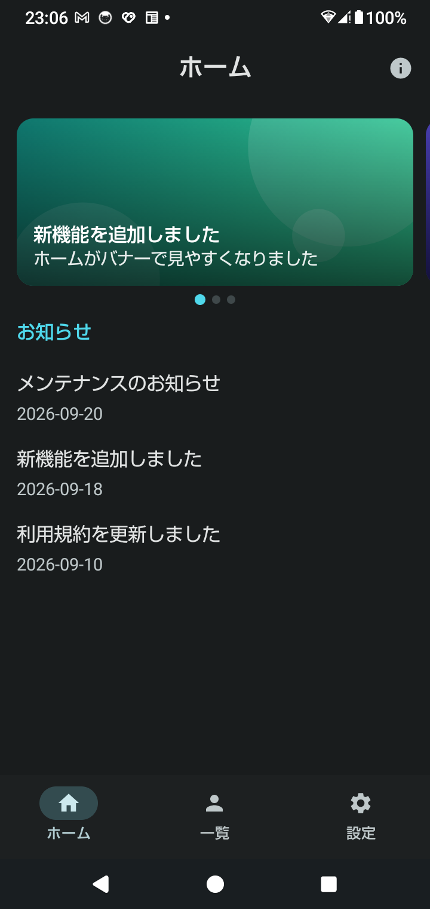
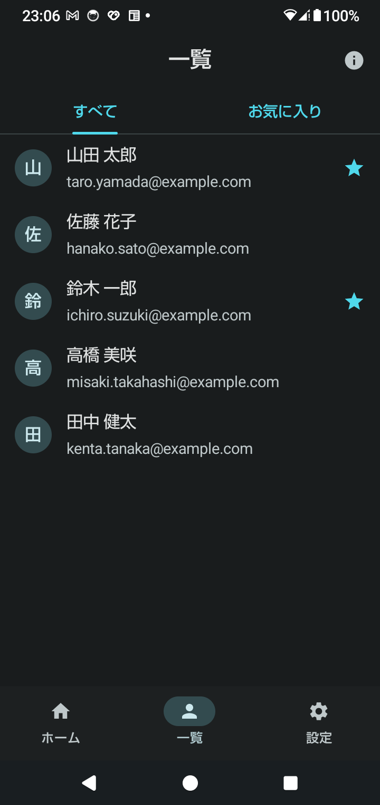
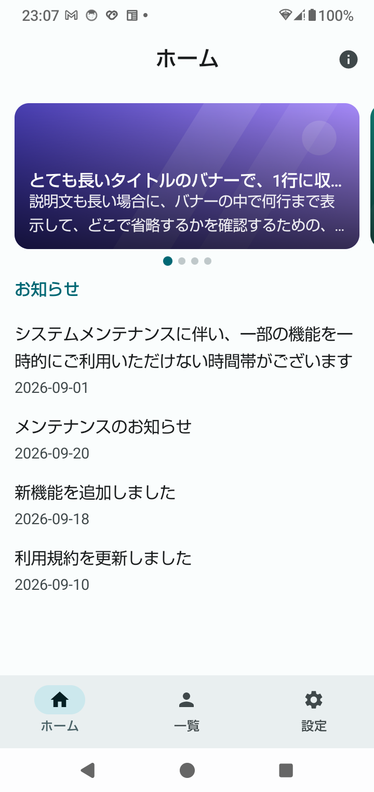
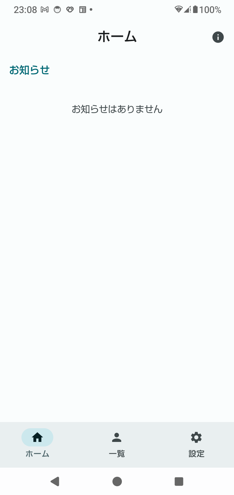

← 前: [01-テーマと骨組み.md](01-テーマと骨組み.md) ｜ [目次に戻る](../03-Compose画面設計解説.md) ｜ 次: [03-下部ナビゲーションと画面遷移.md](03-下部ナビゲーションと画面遷移.md) →

---

## Step 2：静的な3画面

「ホーム／ユーザー一覧／設定」の3画面を、**データを固定値にして**作ります。
この Step の時点では、画面の切り替えは仮のスイッチです（Step 3 で下部ナビゲーションに置き換えました）。
バナーの横スクロールは Step 4 で作りました。一覧のタブと読み込み中・エラー表示は Step 5、
スイッチを動かすのは Step 6 で作りました。

### 2-1. 何を作ったのか

```
ui/
├─ XrStudyApp.kt          ← 画面を切り替える仮のスイッチを追加（Step 3 で NavHost に置き換え済み）
├─ SampleData.kt          ← 固定のデータ（お知らせ・ユーザー）
├─ PreviewSupport.kt      ← @Preview 用の共通の枠（PreviewFrame）
├─ model/Models.kt        ← データの型（Notice, User）
├─ components/Components.kt  ← 複数の画面で使う部品（SectionHeader, EmptyState）
├─ home/HomeScreen.kt     ← バナー（この Step の時点では場所取り。Step 4 で HorizontalPager に置き換え済み）+ お知らせ
├─ users/UserListScreen.kt ← ユーザー一覧（Step 5 で、タブ・LazyColumn・状態ごとの表示に作り直し）
└─ settings/SettingsScreen.kt ← 設定
```

**画面ごとにフォルダを分けています**（`home/`、`users/`、`settings/`）。
ファイルの種類（画面だけ・部品だけ）ではなく、**機能で分ける**と、
「ホームを直したい」ときに、`home/` の中だけを見ればよくなります。

### 2-2. 画面は「データを引数で受け取る」だけ

```kotlin
@Composable
fun HomeScreen(
    notices: List<Notice>,        // ← データは引数で受け取る
    modifier: Modifier = Modifier,
)
```

`HomeScreen` は、データの出どころ（固定値なのか、通信なのか）を**知りません**。
渡されたものを表示するだけです。Phase 1 の `CounterCard` が、`count` を引数で受け取っていたのと同じ
**state hoisting（状態を上に持たせる）** の考え方です。

この作りだと、**同じ画面に、違うデータを渡して確認できます**。

```kotlin
HomeScreen(notices = SampleData.notices)               // 通常
HomeScreen(notices = listOf(SampleData.longNotice) + …) // 長い文字列
HomeScreen(notices = emptyList())                       // 空状態
```

`@Preview` で「通常・長い文字列・空状態」を並べて確認できるのは、このためです。
**画面の中で `SampleData` を直接読んでいたら、この確認はできません。**

`SampleData.kt` は、「固定のデータを、1か所に集める」ためのファイルです。
Phase 4 以降で、通信やデータベースから取ってくるようになったとき、
画面のコードは変えずに、**データの渡し方だけを変えれば済みます**。

#### `listOf` と `data class` — データの作り方

`SampleData.kt` のデータは、次のように書いています。

```kotlin
val notices = listOf(
    Notice(1, "メンテナンスのお知らせ", "2026-09-20"),
    Notice(2, "新機能を追加しました", "2026-09-18"),
    Notice(3, "利用規約を更新しました", "2026-09-10"),
)
```

これは、「**`Notice` を3つ作って、リストに入れ、`notices` という名前を付けた**」という意味です。

**`Notice` は、データの入れ物の設計図（型）です。** `Models.kt` で定義しています。

```kotlin
data class Notice(val id: Int, val title: String, val date: String)
```

**`Notice(1, "…", "…")` は、その設計図から、実際の1件分のデータ（インスタンス）を1つ作る**書き方です。

```kotlin
Notice(1, "メンテナンスのお知らせ", "2026-09-20")
       │   │                        └ date
       │   └ title
       └ id
```

引数は、`id`、`title`、`date` の**定義の順番**で渡します。名前を付けて書くこともできます。

```kotlin
Notice(id = 1, title = "メンテナンスのお知らせ", date = "2026-09-20")
```

**`listOf` は、リスト（`List`）を作ります。** Swift の配列（`[Notice]`）に近いものです。

| 項目 | 内容 |
|---|---|
| 型 | `List<Notice>`（「Notice のリスト」。Kotlin が自動で判断します） |
| 順番 | 入れた順に並ぶ |
| 取り出し | `notices[0]`（1つ目）、`notices.size`（個数）、`notices.forEach { … }`（順に処理）、`notices.isEmpty()`（空か） |
| 変更 | **できません**（`add` や `remove` が無い。読み取り専用） |

- 変更できるリストが必要なときは、`mutableListOf(...)` を使います。
- 普通の配列（`arrayOf`）もありますが、あまり使いません。**`List` を使う**のが一般的です。
- リストを足したいときは、`+` で、**新しいリストを作ります**（元のリストは変わりません）。
  Preview で `listOf(SampleData.longNotice) + SampleData.notices` と書いているのが、この使い方です。
- `data class` の値も、`val`（変更不可）です。1項目だけ違うコピーが欲しいときは、
  `notice.copy(title = "新しいタイトル")` と書くと、**別のインスタンス**ができます。

**Swift で書くと：**

```swift
struct Notice { let id: Int; let title: String; let date: String }

let notices = [
    Notice(id: 1, title: "メンテナンスのお知らせ", date: "2026-09-20"),
    Notice(id: 2, title: "新機能を追加しました", date: "2026-09-18"),
    Notice(id: 3, title: "利用規約を更新しました", date: "2026-09-10"),
]
```

- Swift の `struct` に、Kotlin の `data class` が対応します。
- Swift は、引数名（`id:` など）を必ず書きますが、Kotlin は、書かなくても構いません（順番で決まります）。
- 最後の項目の後ろの `,` は、あっても構いません。項目を足すときに、差分が小さくなるので、付けることが多いです。

### 2-3. 一覧の1行は `ListItem`

```kotlin
ListItem(
    leadingContent = { Avatar(…) },                  // 左（アイコン・画像）
    headlineContent = { Text(user.name) },           // 主題
    supportingContent = { Text(user.email) },        // 補足
    trailingContent = { Switch(…) },                 // 右（スイッチ・値）
)
```

`ListItem` は、Material 3 の**「一覧の1行」の部品**です。
4つの場所に中身を渡すだけで、余白・文字スタイル・色が自動で決まります
（`headline` は `bodyLarge`、`supporting` は `bodyMedium` など）。使わない場所は省略できます。

SwiftUI の `List` の中の行（`HStack` を自分で組む代わりの、決まった形の行）に近い部品です。

#### 丸いアバター（画像の代わり）

```kotlin
Surface(
    shape = CircleShape,
    color = MaterialTheme.colorScheme.secondaryContainer,
    contentColor = MaterialTheme.colorScheme.onSecondaryContainer,
    modifier = Modifier.size(40.dp)
) {
    Box(contentAlignment = Alignment.Center) { Text(initial) }
}
```

`Surface` に「背景色（`color`）」と「中の文字色（`contentColor`）」を渡しています。
中の `Text` は色を書かなくても、`contentColor` で描かれます（1-2 の「背景と文字はペア」）。
背景が `secondaryContainer`、文字が `onSecondaryContainer` という、**ペアの組み合わせ**です。

#### 設定のスイッチ

```kotlin
Switch(checked = checked, onCheckedChange = null)
```

`onCheckedChange = null` は、「押されても何もしない（表示専用）」という指定です。
今の Step 2 では、見た目だけを作るので、これで足ります。
押したら切り替わるようにする（Step 6 で作りました）には、状態（`checked`）と、押されたときの処理を、
**親から受け取る形**にします。`CounterCard` の `count` と `onIncrement` と同じ形です。

### 2-4. 「長い文字列」と「空状態」を最初から作る

見た目を作るとき、**固定のきれいなデータだけで確認すると、あとで崩れます。**
実際のデータは、こちらの都合の長さでは来ません。

#### 長い文字列：`maxLines` と `overflow`

```kotlin
Text(text = user.name, maxLines = 1, overflow = TextOverflow.Ellipsis)
```

| 指定 | 動き |
|---|---|
| なし | 長いと何行にも折り返す。行の高さがバラバラになる |
| `maxLines = 1` + `Ellipsis` | 1行に収まらない分を「…」で省略する |

**どこを1行にして、どこを折り返すかは、デザインの指定次第**です。

- ユーザー一覧の名前・メール：1行で省略（行の高さをそろえたい）
- ホームのお知らせのタイトル：2行まで（意味が伝わるように、少し余裕を持たせる）

SwiftUI の `.lineLimit(1)` と `.truncationMode(.tail)` に相当します。

#### 空状態：`EmptyState`

```kotlin
if (users.isEmpty()) {
    EmptyState("ユーザーがいません")
} else {
    users.forEach { user -> UserRow(user) }
}
```

データが 0 件のとき、何も出さないと**画面が真っ白**になり、壊れたように見えます。
「今は 0 件です」と伝える表示を、最初から用意します。

SwiftUI の `ContentUnavailableView`（iOS 17 以降）に相当します。

#### 名前が空でも落ちないようにする

```kotlin
Text(text = initial.firstOrNull()?.toString() ?: "?")
```

`first()` は、文字列が空だと**例外でアプリが落ちます**。
`firstOrNull()` は、空なら `null` を返すので、`?: "?"` で代わりの文字を出せます。
**外から来るデータは、空・長い・欠けている、が起こりうる**という前提で書きます。

### 2-5. ⚠️ `Column` + `verticalScroll` + `forEach` は、件数が少ないときだけ

```kotlin
Column(modifier = Modifier.verticalScroll(rememberScrollState())) {
    users.forEach { user -> UserRow(user) }
}
```

この書き方は、**画面に見えない行まで、全部作ってしまいます。**
5件なら問題ありませんが、1000件になると、起動が遅くなり、メモリも使います。

Step 5 で、**見えている行だけを作る `LazyColumn`** に置き換えました（Step 5 の 5-3）。
（SwiftUI の `List` が、見えている行だけを作るのと同じです）

### 2-6. `@Preview` を「通常・長い文字列・空状態・ダーク」で並べる

```kotlin
@Preview(name = "通常", showBackground = true, heightDp = 640)
@Composable
private fun HomeScreenPreview() {
    PreviewFrame { HomeScreen(notices = SampleData.notices, …) }
}

@Preview(name = "空状態", showBackground = true, heightDp = 640)
@Composable
private fun HomeScreenEmptyPreview() {
    PreviewFrame { HomeScreen(notices = emptyList(), …) }
}
```

（Step 2 の時点では、ユーザー一覧の Preview を例にしていました。ユーザー一覧は、Step 5 で、状態を引数で渡す形に
変わったので、ここでは、ホーム画面の Preview に置き換えています。）

- `PreviewFrame` は、テーマ（`XRStudyTheme`）と背景色を付ける共通の枠です（`PreviewSupport.kt`）。
  **テーマで包まないと、Preview では色や文字が Material の初期値になります。**
- `heightDp` は、Preview の高さです。指定しないと、中身の高さに縮みます。
- Preview 関数は `private` にして、アプリ本体から呼ばれないようにします。

Android Studio では、1つのファイルの Preview が**縦に並んで**表示されます。
実機やエミュレーターを動かさずに、4つの状態を一度に見比べられます。
SwiftUI の `#Preview` を、複数並べるのと同じ使い方です。

#### 「4パターン」に決まりはあるのか

**決まりは、ありません。** 公式ドキュメントで確認できたのは、「4パターンを作る」という決まりではなく、
Preview の**便利な仕組み**です。

大事なのは、**その画面が取りうる状態を、Preview で見えるようにしておく**という考え方です。
このプロジェクトの4パターンは、この考え方を、2つの画面に当てはめて選んだものです
（ロードマップ 5-2 の「通常・長い文字列・空状態・エラー状態を個別に確認する」に沿っています）。

| パターン | 見ること |
|---|---|
| 通常 | 基本の見た目 |
| 長い文字列 | 実際のデータは、こちらの都合の長さでは来ない（2-4） |
| 空状態 | データが 0 件のとき、画面が真っ白にならないか |
| ダーク | ライトとダークで、読めなくならないか |

**画面によって、必要なパターンは変わります。**

- 設定画面には、「空状態」がありません
- 通信する画面なら、「読み込み中」と「エラー」が要ります（エラー状態は、Step 5 で足します）

#### 公式ドキュメントにある Preview の仕組み

| 仕組み | 使いどころ |
|---|---|
| `@PreviewLightDark` | ライトとダークを、**1つの指定で並べる**（今は、ダーク用の関数を別に書いている） |
| `@PreviewFontScale` | 文字を大きくしたときの崩れを見る（ロードマップ 5-2 の「文字が大きい場合の崩れ」に合う） |
| `@PreviewScreenSizes` | 画面の大きさ違いを並べる |
| `@PreviewParameter` | 1つの Preview 関数に、データを何種類か渡して並べる（`PreviewParameterProvider` と組み合わせる） |
| 自作のアノテーション | 複数の `@Preview` をまとめて、1つの名前で使い回す（Multipreview） |

上の5つのうち、`@PreviewLightDark`、`@PreviewFontScale`、`@PreviewScreenSizes`、`@PreviewParameter` は、
このプロジェクトのライブラリ（`ui-tooling-preview` 1.12.0）に入っていることを確認しました。

**今の書き方との違い：** 今の `PreviewFrame` は、ダークかどうかを**引数**（`darkTheme`）で渡しています。
`@PreviewLightDark` は、端末のダークモード設定（`uiMode`）で切り替わる仕組みなので、使うには、
`PreviewFrame` を、端末の設定に従う形（`isSystemInDarkTheme()`）に変える必要があります。

**画面の作りとの関係：** 公式ドキュメントにも、ViewModel の代わりに、**状態を引数で渡す**形にすると
Preview しやすい、という説明があります。2-2 の「画面はデータを引数で受け取るだけ」と同じ考え方です。

#### 名前の付け方

公式のサンプルは、関数名の**末尾**に `Preview` を付ける例が多く（`UserProfilePreview` など）、
先頭に付ける例もあります。どちらかに統一すれば十分です。このプロジェクトは末尾に付けています。

#### Preview と実機の使い分け

**デザインの確認は Preview、動きの確認は実機**、と分けるのが基本です。

| | Preview | 実機 |
|---|---|---|
| 得意なこと | 見た目の確認。変更してすぐ見られる | 動きの確認 |
| 向いている確認 | 色、余白、文字、ダーク、長い文字列、空状態、文字を大きくしたとき | 画面遷移、戻るボタン、回転、ライフサイクル、スクロール、アニメーション、キーボード、速さ |

**おすすめの流れ：**

```
① Preview で、デザインの状態を確認（通常・長い文字列・空状態・ダーク）
      ↓
② 問題なければ、実機で「動き」を確認（画面遷移、戻るボタン、回転）
      ↓
③ デザイナーさんの Figma と、実機の見た目を見比べる
```

Preview で見た目を固めておくと、実機での確認が、動きの確認に集中できます。

**このプロジェクトで、実機やログで初めて分かったこと：**

| 分かったこと | どこで |
|---|---|
| 戻るボタンの動き（ホーム → 一覧 → 設定 → 戻る → ホーム。`popUpTo` を外すと、逆にたどる） | Step 3 |
| 起動・回転の直後、「今の宛先」が一瞬 `null` になる（下部ナビが遅れて現れかける） | Step 3（ログで確認） |
| `innerPadding` を渡さないと、本文がバーの裏に潜り込む | Step 1・2・3 の課題4 |
| 回転しても、選んだタブが残る。ホームボタンで離れて戻っても、Compose は組み立て直されない | 起動の流れ（ログで確認） |
| 戻るボタンで Activity が終了するかどうかは、起動方法（`adb` かアイコンか）で変わる | Step 3 |
| ダークモードでの起動直後の背景（`values-night/themes.xml`）。Compose の外にある XML の設定なので、Preview には出ない | Step 1 |

- `innerPadding` の抜けは、Preview でも、システムバーを含めて表示する設定（`showSystemUi = true`）を付ければ確認できます。
  付けないと、見逃しやすいです。

**Preview の限界**（一般的な知識です。このプロジェクトでは確認していません）：

- Preview は、Android の一部の機能（権限、カメラ、通信、システムのサービスなど）を動かせません。
  **Phase 7 のカメラは、実機が必須**です。
- フォントや影の描画が、実機と少し違うことがあります。**最終の見た目は、実機で確かめる**のが安全です。

### 2-7. 画面を切り替える仮のスイッチ（Step 3 で置き換え済み）

Step 2 の時点では、実機で3画面を見るために、画面上部に**仮のスイッチ**（`SegmentedButton`）を付け、
選んだ画面を `rememberSaveable` で持ち、`when` で画面を切り替えていました。

このスイッチは、Step 3 で `NavigationBar` と `NavHost` に置き換えました（後半の Step 3 を参照）。
このときの書き方のうち、次の2つは、今も使える知識です。

- **`when` は、`enum` の全ての値を書かないとコンパイルエラーになります。**
  値を足したときに、書き忘れに気づけます。
- **`Modifier.weight(1f)`** は、「残りの高さを使い切る」指定です。

> Step 2 の時点の書き方は、`git show 4ac1cb2:app/src/main/kotlin/com/example/xrstudy/ui/XrStudyApp.kt` で確認できます。

### 2-8. 実機で確認した結果

SH-51C（Android 14）で確認しました。長い文字列と空状態は、`XrStudyApp.kt` のデータを一時的に
差し替えて、実機の画面で確認しました（`@Preview` ではなく、実機の表示です）。

| 確認したこと | 結果 |
|---|---|
| 3画面の表示 | ホーム・一覧・設定とも表示された。下端もナビゲーションバーと重ならない |
| 長い文字列（ホーム） | お知らせのタイトルが2行に折り返した |
| 長い文字列（一覧） | 名前とメールが1行で「…」に省略された |
| 空状態 | 「お知らせはありません」「ユーザーがいません」が表示された |
| 回転（横向き） | 選んだ「一覧」が残った。右側のナビゲーションバーを避けて表示された |

3画面（通常時）と、ホームの「長い文字列」「空状態」です。

| ホーム | 一覧 | 設定 |
|---|---|---|
|  |  |  |

ダークにすると、こうなります。

| ホーム | 一覧 |
|---|---|
|  |  |

| ホーム（長い文字列） | ホーム（空状態） |
|---|---|
|  |  |

### 2-9. iOS との比較

| 観点 | iOS（SwiftUI） | Android（Compose） |
|---|---|---|
| 一覧の1行 | `List` の中の行（`HStack` など） | `ListItem` |
| 長い文字の省略 | `.lineLimit(1)` + `.truncationMode(.tail)` | `maxLines = 1` + `overflow = Ellipsis` |
| 0 件の表示 | `ContentUnavailableView` | 自分で作る（`EmptyState`） |
| スイッチ | `Toggle` | `Switch` |
| 複数の状態のプレビュー | `#Preview` を複数並べる | `@Preview` を複数並べる |
| 画面にデータを渡す | イニシャライザの引数 | 関数の引数（state hoisting） |

---

## 手を動かして確かめる（Step 2）

### 課題1：長い文字列を表示する（5分）※戻すこと

`XrStudyApp.kt` の、ホームに渡しているデータと、`FakeUserApi.kt`（一覧のデータ）を変えます。

```kotlin
// XrStudyApp.kt
composable<HomeRoute> { HomeScreen(notices = listOf(SampleData.longNotice) + SampleData.notices, …) }

// FakeUserApi.kt（Step 5 で追加。一覧のデータは、ここから返る）
return listOf(SampleData.longUser) + SampleData.users
```

アプリを入れ直して確認してください。

- ホーム：長いタイトルが**2行**に折り返す
- 一覧：長い名前とメールが**1行で「…」に省略**される

次に、`HomeScreen.kt` の `NoticeRow` の `maxLines = 2` を `1` に変えます。
ホームの長いタイトルも、1行で省略されます。
**`maxLines` を消す**と、何行でも折り返します。

確認したら元に戻してください。

### 課題2：空状態を表示する（3分）※戻すこと

同じ場所を、`emptyList()` に変えます（一覧は、`FakeUserApi.kt` の `return` です）。

```kotlin
notices = emptyList()                 // XrStudyApp.kt
return emptyList()                    // FakeUserApi.kt
```

「お知らせはありません」「ユーザーがいません」が表示されます。
**画面のコードは変えず、渡すデータだけを変えた**点に注目してください。

確認したら元に戻してください。

### 課題3：データを足す（3分）※戻すこと

`SampleData.kt` の `users` に、1人足します。

```kotlin
User(6, "伊藤 由美", "yumi.ito@example.com"),
```

一覧に、1行増えます。**画面のコードは1文字も変えていません。**
データを足すだけで画面が変わる、というのが「画面はデータを受け取るだけ」の利点です。

確認したら元に戻してください。

### 課題4：名前が空のユーザーで落とす（5分）※戻すこと

**「外から来るデータは、空でもありうる」を体験します。**

1. `SampleData.kt` の `users` に、名前が空のユーザーを足します。

   ```kotlin
   User(6, "", "no-name@example.com"),
   ```

2. アプリを入れ直します。一覧に、「?」の丸が出ます（`firstOrNull` のおかげで落ちません）。

3. 次に、`UserListScreen.kt` の `Avatar` の中を、`first()` に変えます。

   ```kotlin
   text = initial.first().toString()   // firstOrNull()?.toString() ?: "?" から変更
   ```

4. アプリを入れ直して、一覧を開きます。**アプリが落ちます。**
   `adb logcat` で `NoSuchElementException` を確認してください。

確認したら、`firstOrNull` の形と、追加したユーザーを元に戻してください。

### 課題5：`@Preview` を見る（10分）

Android Studio で、次のファイルを開き、右上の「Split」または「Design」を選びます。

- `home/HomeScreen.kt`
- `users/UserListScreen.kt`
- `settings/SettingsScreen.kt`

「通常」「長い文字列」「空状態」「ダーク」の Preview が、並んで表示されます。
**実機を動かさずに**、状態を見比べられることを確認してください。

### 課題6：回転して、選んだ画面が残ることを確認する

Step 3 で、選んだ画面を持つ仕組みが `rememberSaveable` から `NavController` に変わりました。
この課題は、Step 3 の課題4（回転しても、選んだタブが残ること）に移しました。

---

← 前: [01-テーマと骨組み.md](01-テーマと骨組み.md) ｜ [目次に戻る](../03-Compose画面設計解説.md) ｜ 次: [03-下部ナビゲーションと画面遷移.md](03-下部ナビゲーションと画面遷移.md) →
