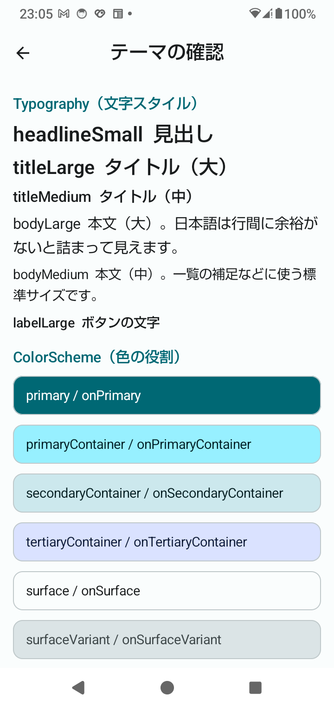
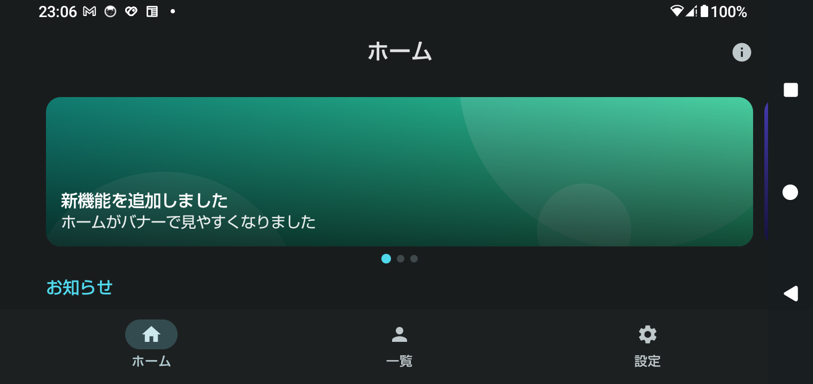

← 前: [02-静的な3画面.md](02-静的な3画面.md) ｜ [目次に戻る](../03-Compose画面設計解説.md) ｜ 次: [04-横スクロールバナー.md](04-横スクロールバナー.md) →

---

## Step 3：下部ナビゲーションと画面遷移

Step 2 の仮のスイッチを、本物の**下部ナビゲーション**と**画面遷移（`NavHost`）** に置き換えます。
主なテーマは、**戻るボタンを押したときの動き**と、**選んでいるタブを正しく表示すること**です。

### 3-1. 何を作ったのか

```
gradle/libs.versions.toml、app/build.gradle.kts
    ← 依存を追加（下の表）
ui/
├─ XrStudyApp.kt              ← Scaffold + NavigationBar + NavHost（仮のスイッチを削除）
└─ navigation/
    ├─ Routes.kt              ← 画面の宛先（HomeRoute など）
    └─ TopLevelDestination.kt ← 下部ナビに並ぶ3画面（名前・アイコン・宛先）
```

| 追加した依存 | 役割 |
|---|---|
| `navigation-compose` 2.10.1 | `NavHost` / `NavController`（画面遷移） |
| `material-icons-core` | アイコン（`Icons.Filled.Home` など）。**`material3` には含まれない**ので、別に必要（入れ忘れると `Icons` が見つからずコンパイルエラーになります） |
| Kotlin の serialization プラグイン | 型安全なルート（`@Serializable`）に必要 |

### 3-2. なぜ `NavHost`（Navigation Compose）にしたのか

Compose の画面遷移には、2つのライブラリがあります。

| | 書き方 | 安定版（2026-09 時点、Google Maven で確認） |
|---|---|---|
| Navigation Compose | `NavHost` + `NavController` | 2.10.1 |
| Navigation 3 | `NavDisplay` + バックスタックを自分で持つ | 1.1.7 |

**どちらも安定版があります。** このプロジェクトでは、次の理由で `NavHost` にしました。

- ロードマップが `NavHost` を指定している
- 下部ナビゲーションの「タブごとの状態の保存・復元」が、`navigate` の指定だけで書ける（3-7）
- 公式ドキュメントの Compose ナビゲーションのページ（今回確認したもの）が、`NavHost` の書き方で書かれている

Navigation 3 は、将来の選択肢です。公式ドキュメントが、新規のアプリにどちらを推奨しているかは、
今回調べた範囲では読み取れませんでした。

### 3-3. `NavHost` の3つの部品

```kotlin
val navController = rememberNavController()          // ① 今どこにいるか、どの順で来たかを持つ

NavHost(                                             // ② 今の宛先の画面を表示する場所
    navController = navController,
    startDestination = HomeRoute,                    //    最初の宛先
) {
    composable<HomeRoute> { HomeScreen(…) }          // ③ 宛先ごとに、表示する画面を登録する
    composable<UsersRoute> { UserListScreen(…) }
}

navController.navigate(UsersRoute)                   // 画面を移動する
```

| 部品 | 役割 |
|---|---|
| `NavController` | **バックスタック**（今までに開いた画面の履歴）を持つ。`navigate` で積み、`popBackStack` で戻る |
| `NavHost` | バックスタックの一番上の宛先を、画面に表示する |
| `composable<宛先>` | 「この宛先のときは、この画面を表示する」という登録 |

`rememberNavController` は、**回転しても、バックスタックを保ちます**（課題4で確認します）。
SwiftUI の `NavigationStack` と、その `path`（画面の履歴）に近い仕組みです。

### 3-4. 宛先は「型」で書く（型安全なルート）

```kotlin
@Serializable
object HomeRoute

@Serializable
object UsersRoute
```

画面の宛先を、`"home"` のような文字列ではなく、**型**（`@Serializable` の `object`）で表します。

```kotlin
navController.navigate(UsersRoute)          // ✅ 型で指定
navController.navigate("usres")             // ❌ 文字列だと、打ち間違いに実行時まで気づけない
```

型なら、打ち間違いは**コンパイルエラー**になります。
今回の宛先は、受け取る値（引数）が無いので `object` です。引数がある宛先は `data class` にします
（例：`data class UserDetailRoute(val id: Int)`）。

### 3-5. 下部ナビゲーション

```kotlin
enum class TopLevelDestination(val route: Any, val label: String, val icon: ImageVector) {
    Home(HomeRoute, "ホーム", Icons.Filled.Home),
    Users(UsersRoute, "一覧", Icons.Filled.Person),
    Settings(SettingsRoute, "設定", Icons.Filled.Settings),
}
```

```kotlin
NavigationBar {
    TopLevelDestination.entries.forEach { top ->
        NavigationBarItem(
            selected = top == selectedTopLevel,
            onClick = { navController.navigateToTopLevel(top) },
            icon = { Icon(top.icon, contentDescription = null) },
            label = { Text(top.label) },
        )
    }
}
```

- **名前・アイコン・宛先を、enum に1か所にまとめています。** 画面を足すときは、enum に1行足せば、下部ナビにも出ます。
- **アイコンの `contentDescription` は `null` です。** 文字（`label`）が見えているので、説明を付けると、
  読み上げで同じ内容が2回読まれるためです。逆に、文字が無いアイコンだけのボタン
  （Top App Bar の (i) ボタン、戻る矢印）には、必ず説明を付けます。
- Material 3 の下部ナビゲーションは、**3〜5個**の主要な画面に向いています。

### 3-6. ★ 選択中のタブは、バックスタックから求める

```kotlin
val backStackEntry by navController.currentBackStackEntryAsState()
val currentDestination = backStackEntry?.destination

val selectedTopLevel = TopLevelDestination.entries.firstOrNull { top ->
    currentDestination?.hierarchy?.any { it.hasRoute(top.route::class) } == true
}
```

**「選択中のタブ」を、`rememberSaveable` などの別の変数で持ちません。**
`NavController` が持つ「今の宛先」から、毎回求めます。

公式ドキュメントのサンプルには、選択中のタブを `rememberSaveable` の変数で別に持つ書き方があります。
この書き方だと、**戻るボタンで前の画面に戻ったとき、画面は変わるのに、タブの表示が変わらない**
というずれが起きるおそれがあります（サンプルそのものは、実行して確かめていません）。

今の宛先から求めれば、**タップでも、戻るボタンでも、回転でも、常に画面とタブが一致します。**
「状態は、1か所だけで持つ」という原則です（同じ情報を2か所で持つと、ずれる）。

### 3-7. タブを押したときの移動

```kotlin
private fun NavController.navigateToTopLevel(destination: TopLevelDestination) {
    navigate(destination.route) {
        popUpTo(graph.findStartDestination().id) { saveState = true }
        launchSingleTop = true
        restoreState = true
    }
}
```

下部ナビゲーションの、決まった書き方です。3つの指定には、それぞれ役割があります。

| 指定 | 役割 | 外すと |
|---|---|---|
| `popUpTo(最初の画面) { saveState = true }` | タブを移るたびに、バックスタックが積み上がらないようにする。抜ける画面の状態は保存する | 戻るボタンで、押してきたタブを**逆にたどる** |
| `launchSingleTop = true` | 表示中のタブをもう一度押しても、同じ画面を重ねて作らない | 同じ画面が積み重なる |
| `restoreState = true` | 前に開いたタブに戻ったとき、保存した状態を復元する | スクロール位置などが**先頭に戻る** |

#### 実機で確認した動き（SH-51C・Android 14）

**指定を全部付けたとき：** ホーム → 一覧 → 設定 → 戻るボタン

```
[Nav] 宛先が変わった → UsersRoute
[Nav] 宛先が変わった → SettingsRoute
[Nav] 宛先が変わった → HomeRoute        ← 戻るボタン。一覧ではなく、ホームに戻る
```

バックスタックが積み上がらないので、戻るボタンは、**最初の画面（ホーム）に戻ります**。
これが、下部ナビゲーションの標準的な動きです。

**`popUpTo` を外したとき：** ホーム → 一覧 → 設定 → ホーム（タップ）→ 戻るボタンを3回

```
[Nav] 宛先が変わった → UsersRoute
[Nav] 宛先が変わった → SettingsRoute
[Nav] 宛先が変わった → HomeRoute        ← タップ
[Nav] 宛先が変わった → SettingsRoute    ← 戻る（押してきたタブを逆にたどる）
[Nav] 宛先が変わった → UsersRoute
[Nav] 宛先が変わった → HomeRoute
```

**`saveState` と `restoreState` を外したとき：** 一覧を下へスクロールし（先頭が「ユーザー 26」）、
ホームに移って一覧に戻る

| | 一覧に戻ったときの先頭 |
|---|---|
| 指定あり（`saveState` + `restoreState`） | **ユーザー 27 のまま**（スクロール位置が残る） |
| 指定なし | **ユーザー 1**（先頭に戻る） |

（40件の一覧は、確認用に一時的に差し替えたものです。スクロール位置の保存には、
Step 1 で確認した `rememberScrollState` が、`Saver` で保存に対応していることが使われています）

### 3-8. 戻るボタンの動き

#### タブの画面で戻る

最初の画面（ホーム）で、もう一度戻るボタンを押すと、アプリを離れます。

- `adb`（`monkey`）で起動した場合は、`onPause → onStop → onDestroy` まで進み、Activity が**終了**しました。
- ホーム画面のアイコンから起動した場合は、Android 12 以降、バックグラウンドへ移るだけで
  `onDestroy` まで進みません（Phase 1 の課題4）。今回は、この端末のホーム画面のページに、
  アプリのアイコンが見当たらず、Step 3 の構成では確認できていません。

**起動方法で、戻るボタンの結果が変わる**ことに注意してください
（`adb` から起動したタスクは、アイコンから起動したタスクと、扱いが違うことがあります）。

#### テーマの確認画面で戻る（トップレベルではない画面）

Top App Bar の (i) ボタンは、`navigate(ThemeRoute)` で、バックスタックに**画面を積みます**。

```kotlin
IconButton(onClick = { navController.navigate(ThemeRoute) }) { … }        // (i) ボタン：積む
IconButton(onClick = { navController.popBackStack() }) { … }              // 戻る矢印：1つ戻る
```

実機で、(i) → 端末の戻るボタン → (i) → 画面の戻る矢印、と操作したログです。

```
[Nav] 宛先が変わった → ThemeRoute
[Nav] 宛先が変わった → HomeRoute        ← 端末の戻るボタン
[Nav] 宛先が変わった → ThemeRoute
[Nav] 宛先が変わった → HomeRoute        ← 画面の戻る矢印
```

**端末の戻るボタンと、画面の戻る矢印は、同じ動き**（1つ前の画面に戻る）です。

### 3-9. ⚠️ 起動・回転の直後は、「今の宛先」が `null`

```
[Compose] XrStudyApp
[Nav] 宛先が変わった → null            ← 最初の組み立て。宛先がまだ決まっていない
[Compose] XrStudyApp                   ← 少し後（コールドスタートで約0.5秒、回転で約0.2秒）に再実行
[Nav] 宛先が変わった → HomeRoute
```

`currentBackStackEntryAsState()` は、最初の組み立てでは `null` を返し、
そのあとで本当の宛先が入ります。

もし、下部ナビを「`selectedTopLevel != null` のときだけ」表示すると、
**下部ナビが遅れて現れ、本文の余白が動いて、画面がガタつきます。**

そのため、バーの表示は、「テーマの確認画面**ではない**」で決めています。

```kotlin
val showTopLevelBars = !isThemeScreen     // null の間も、true（バーが最初から出る）
```

（一瞬、選択中のタブの強調と、タイトルが後から入ります。余白が動くよりは、目立ちません。
この遅れそのものは、ログで確認したもので、目で見て確かめたものではありません）

### 3-10. 画面ごとに Top App Bar と下部ナビを変える

```kotlin
CenterAlignedTopAppBar(
    title = { Text(タブなら label、テーマの確認なら "テーマの確認") },
    navigationIcon = { if (isThemeScreen) { 戻る矢印 } },
    actions = { if (showTopLevelBars) { (i) ボタン } },
)
bottomBar = { if (showTopLevelBars) { NavigationBar { … } } }
```

| 画面 | タイトル | 左 | 右 | 下部ナビ |
|---|---|---|---|---|
| ホーム・一覧・設定 | 画面の名前 | なし | (i) ボタン | **あり** |
| テーマの確認 | テーマの確認 | **戻る矢印** | なし | **なし** |

**`Scaffold` は、アプリの一番外側に1つだけ**置いて、バーの中身を、今の宛先で切り替えています。
（画面ごとに `Scaffold` を持つ作り方もありますが、その場合、下部ナビも画面ごとに別々に組み立てられる
ことになります）

左は、下部ナビが**ある**、トップレベルの画面（ホーム）。右は、下部ナビが**隠れ**、戻る矢印が出る、
サブ画面（テーマの確認）です。

| トップレベル（ホーム） | サブ画面（テーマの確認） |
|---|---|
|  |  |

### 3-11. 実機で確認した結果

| 確認したこと | 結果 |
|---|---|
| 3つのタブの表示 | ホーム・一覧・設定が表示され、選択中のタブが強調された |
| テーマの確認画面 | 戻る矢印が出て、下部ナビが隠れた（スクリーンショットと `uiautomator` で確認） |
| 戻るボタン（タブ） | ホーム → 一覧 → 設定 → 戻る → **ホーム** |
| 戻るボタン（テーマの確認） | 端末の戻るボタン・戻る矢印とも、1つ前の画面に戻った |
| スクロール位置の保存 | ホームに移って一覧に戻っても、**位置が残った** |
| 回転（設定タブ、横向き） | 「設定」が選ばれたまま復元された。下部ナビも表示された |
| `innerPadding` を外す | 場所取りのバナーの上半分が、Top App Bar の裏に隠れた（Step 3 の時点） |

横向き（ダーク）にしたときの例です。右側のナビゲーションバーを避けて、下部ナビも表示されています。



### 3-12. iOS との比較

| 観点 | iOS（SwiftUI） | Android（Compose） |
|---|---|---|
| 画面の履歴 | `NavigationStack` の `path` | `NavController` のバックスタック |
| 宛先の登録 | `navigationDestination(for:)` | `composable<宛先>` |
| 画面を移動する | `path.append(値)` | `navController.navigate(宛先)` |
| 下部のタブ | `TabView` | `NavigationBar` + `NavHost`（自分で組み合わせる） |
| タブごとの状態 | `TabView` が各タブを保持する | `saveState` / `restoreState` の指定で保存・復元する |
| 戻る | 左上の戻るボタン、スワイプ | 端末の戻るボタン（画面の戻る矢印は、自分で作る） |

**`TabView` は、各タブの状態を自動で保持します。** Android は、`navigate` の3つの指定を、
自分で書く必要があります（3-7）。

---

## 手を動かして確かめる（Step 3）

### 課題1：戻るボタンとバックスタックを見る（5分）

```bash
adb logcat -s LIFECYCLE
```

を流したまま、次を行います。

1. ホームから、下部ナビで「一覧」→「設定」と移る
2. 端末の戻るボタンを押す → **「一覧」ではなく、「ホーム」に戻る**

`[Nav]` のログで、バックスタックが積み上がっていないことを確認してください。

### 課題2：`popUpTo` を外す（5分）※戻すこと

`XrStudyApp.kt` の `navigateToTopLevel` から、`popUpTo(…)` の行を外します。

```kotlin
navigate(destination.route) {
    // popUpTo(graph.findStartDestination().id) { saveState = true }   ← 外す
    launchSingleTop = true
    restoreState = true
}
```

ホーム → 一覧 → 設定 → ホーム（タップ）と移ってから、戻るボタンを3回押します。
**設定 → 一覧 → ホーム の順に、押してきたタブを逆にたどります**（3-7 のログと同じです）。

確認したら元に戻してください。

### 課題3：スクロール位置の保存を確かめる（10分）※戻すこと

1. `FakeUserApi.kt` の一覧のデータを、40件に差し替えます（`import com.example.xrstudy.ui.model.User` が必要です）。

   ```kotlin
   return List(40) { User(it + 1, "ユーザー ${it + 1}", "user${it + 1}@example.com") }
   ```

   （Step 5 で、一覧の画面が、データを `FakeUserApi` から受け取る作りに変わったので、差し替える場所が変わりました。
   一覧は、開くたびに、1.5秒の「読み込み中」を経て表示されます）

2. 「一覧」を下へスクロールし、ホームに移って、一覧に戻る → **スクロール位置が残っています**
3. `navigateToTopLevel` から、`saveState = true` と `restoreState = true` を外して、入れ直す
4. 同じ操作をする → **先頭（ユーザー 1）に戻ります**

確認したら、両方を元に戻してください。

### 課題4：回転しても、選んだタブが残ることを確認する（5分）

1. 下部ナビで「設定」を選ぶ
2. 端末を回転させる → **「設定」が選ばれたまま**です
3. ログで、`[Compose] SettingsScreen` が出て、`HomeScreen` が出ないことを確認する

Step 2 の課題6（`rememberSaveable` と `remember` の比較）の代わりです。
選んだタブは、`NavController` のバックスタックに保存されているので、`rememberSaveable` を書かなくても残ります。

### 課題5：テーマの確認画面の、戻り方を比べる（3分）

1. Top App Bar の (i) ボタンで、テーマの確認画面を開く
2. **画面の戻る矢印**で戻る
3. もう一度開いて、**端末の戻るボタン**で戻る

`[Nav]` のログが、どちらも「ThemeRoute → HomeRoute」で、同じ動きであることを確認してください。

---

← 前: [02-静的な3画面.md](02-静的な3画面.md) ｜ [目次に戻る](../03-Compose画面設計解説.md) ｜ 次: [04-横スクロールバナー.md](04-横スクロールバナー.md) →
