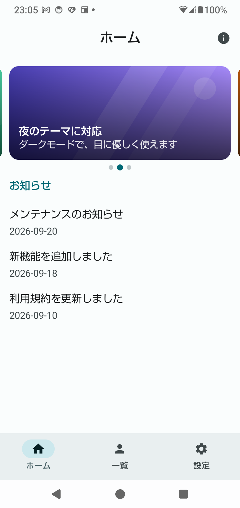
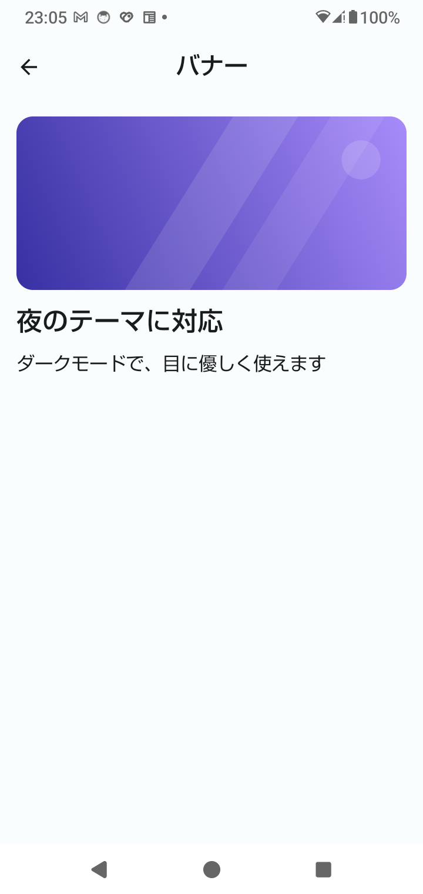
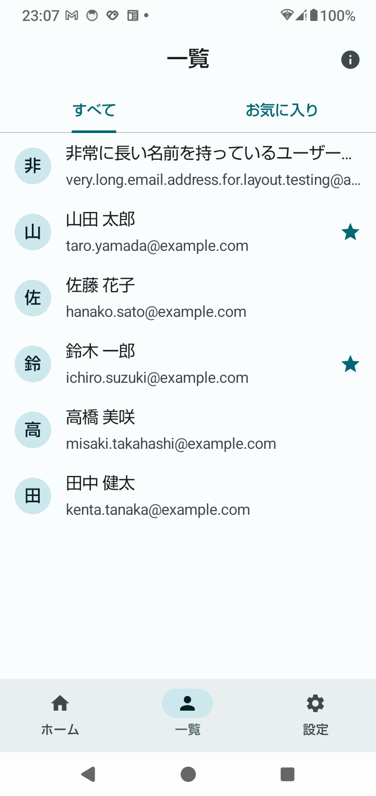

← 前: [03-下部ナビゲーションと画面遷移.md](03-下部ナビゲーションと画面遷移.md) ｜ [目次に戻る](../03-Compose画面設計解説.md) ｜ 次: [05-ユーザー一覧.md](05-ユーザー一覧.md) →

---

## Step 4：横スクロールバナー（HorizontalPager）

Step 2 では、バナーを「場所取り」の四角で置いていました。これを、**横にスワイプして切り替えられる、画像のバナー**に置き換えます。
ロードマップの方針は、「自動送りより、**手でスワイプ、ページ表示、タップでの遷移**を優先する」です。

### 4-1. 何を作ったのか

```
res/drawable/
├─ banner_green.xml        ← 自作のバナー画像（ベクター画像）3枚
├─ banner_indigo.xml
└─ banner_orange.xml
ui/
├─ home/
│   ├─ BannerPager.kt         ← 横スワイプのバナー + ページ表示
│   ├─ BannerDetailScreen.kt  ← バナーをタップしたときの詳細画面
│   └─ HomeScreen.kt          ← 場所取りを BannerPager に置き換え
├─ model/Models.kt            ← Banner を追加
├─ SampleData.kt              ← banners（3件）を追加
└─ navigation/Routes.kt       ← BannerDetailRoute（引数付きの宛先）を追加
```

### 4-2. `HorizontalPager` の基本

```kotlin
val pagerState = rememberPagerState(pageCount = { banners.size })

HorizontalPager(
    state = pagerState,
    contentPadding = PaddingValues(horizontal = 16.dp),
    pageSpacing = 12.dp,
    key = { page -> banners[page].id },
) { page ->
    BannerCard(banner = banners[page], onClick = { onBannerClick(banners[page]) })
}
```

| 部品 | 役割 |
|---|---|
| `HorizontalPager` | 横にスワイプして、1ページずつ切り替える入れ物。SwiftUI の `TabView`（`.page` スタイル）に近い |
| `PagerState` | 「今どのページか」を持つ。`rememberPagerState` で作る |
| `{ page -> … }` | ページの中身。`page` は 0 から始まる位置 |

**`pageCount` は、値（`3`）ではなく、関数（`{ banners.size }`）で渡します。**
あとからデータの件数が変わっても、最新の件数を読めるようにするためです。

**`contentPadding` を付けると、隣のページの端が少し見えます。** 「横にスクロールできる」ことが、見た目で伝わります。
`0.dp` にすると、隣のページは見えなくなります（課題3）。

**`key` は、ページを「位置」ではなく「id」で見分ける**指定です。データの並び順が変わっても、ページごとの状態が混ざりません。

#### ページの位置は、回転しても残る

`rememberPagerState` は、内部で `rememberSaveable` を使っています。実機で、3ページ目まで進めてから、次の操作をしました。

| 操作 | 戻ったあとのページ |
|---|---|
| 別のタブ（一覧）に移って、ホームに戻る | **3ページ目のまま** |
| バナーをタップして詳細を開き、戻る | **3ページ目のまま** |
| 端末を回転させる | **3ページ目のまま** |

タブの移動で残るのは、Step 3 の `saveState` / `restoreState`（3-7）が、この状態も保存してくれるためです。

### 4-3. 画像を表示する

```kotlin
Image(
    painter = painterResource(banner.imageRes),   // R.drawable.banner_green など
    contentDescription = null,
    contentScale = ContentScale.Crop,
    modifier = Modifier.fillMaxSize(),
)
```

#### 画像は、`res/drawable` に置いて、`R.drawable.ファイル名` で参照する

- このプロジェクトのバナー画像は、**自作のベクター画像（XML）** です。点と線で描く画像で、拡大しても粗くならず、
  ファイルも小さくなります。外部の素材を使っていないので、権利の心配がありません
  （ロードマップの「画像・アイコンを無断でアプリへ流用しない」に沿っています）。
- **PNG や JPG などの写真も、同じ書き方**（`painterResource`）で読み込めます。ファイルを `res/drawable` に置くだけです。
- Web 上の画像を表示するには、別のライブラリ（Coil など）が要ります（一般的な知識です。このプロジェクトでは使っていません）。

```kotlin
data class Banner(
    val id: Int,
    @DrawableRes val imageRes: Int,     // ← 画像リソースの ID
    val title: String,
    val description: String,
)
```

`@DrawableRes` は、「この `Int` は、画像リソースの ID です」という**印**です。ただの `Int` と区別できるので、
間違って別の数字（ユーザーの `id` など）を渡すと、Android Studio が警告してくれます。

#### `contentScale` — 画像を枠に合わせる方法

| 指定 | 動き |
|---|---|
| `Crop` | 縦横の比率を保ったまま、枠いっぱいに広げ、**はみ出た分を切る**（バナーに向く） |
| `Fit` | 縦横の比率を保ったまま、枠に**収まる**ように縮める（余白ができることがある） |
| `FillBounds` | 枠いっぱいに**引き伸ばす**（比率が崩れる） |

#### `contentDescription`（画像の説明）

バナーの画像は、`contentDescription = null`（説明なし）にしています。
画像の意味は、上に重ねたタイトルと説明で、すでに伝わっているためです。
**画像だけで意味を持つとき（文字が無いアイコンなど）は、必ず説明を付けます。**

### 4-4. 画像の上に文字を重ねる

```kotlin
Box {
    Image(…)                                         // ① 画像
    Box(Modifier.fillMaxSize().background(           // ② 下が暗くなる膜
        Brush.verticalGradient(listOf(Color.Transparent, Color.Black.copy(alpha = 0.65f)))))
    Column(Modifier.align(Alignment.BottomStart)…) { // ③ 文字
        Text(banner.title, color = Color.White, …)
    }
}
```

`Box` は、中に置いた部品を**重ねて**表示します（SwiftUI の `ZStack`）。**書いた順に、下から上へ**重なります。

- **② の膜が必要な理由：** 画像の色は、どんな色にもなりえます。下を暗くしておくと、白い文字が、どの画像でも読めます。
- **文字色を `Color.White` に固定している理由：** 背景が「テーマ」ではなく「画像」で、ライトとダークで変わらないためです。
  **「色を直接書かない」原則（1-2）の、数少ない例外**です。

### 4-5. ページ表示（● ○ ○）

```kotlin
PageIndicator(pageCount = banners.size, currentPage = pagerState.currentPage)
```

```kotlin
repeat(pageCount) { index ->
    val selected = index == currentPage
    Box(
        Modifier
            .size(if (selected) 10.dp else 8.dp)
            .clip(CircleShape)
            .background(if (selected) primary else outlineVariant)
    )
}
```

- **点の数は、ページ数。今のページだけ、大きく、色を変えます。** このプロジェクトの `material3`（1.4.0）には、標準のページ表示の部品が
  見当たらなかったので、自分で作ります。
- **`PageIndicator` は、`currentPage`（数字）を受け取るだけで、`PagerState` を知りません**（state hoisting）。
  見た目を確認するときは、数字を渡すだけで済みます。
- **`currentPage` は、スワイプ中に、一番近いページに切り替わります**（半分を超えたあたり）。スワイプが終わって落ち着いたページは、`settledPage` で取れます
  （`PagerState` に、どちらもあることを、ライブラリ `foundation` 1.12.0 で確認しました）。
- **読み上げ用の説明を付けています。** 目で見るだけの部品なので、`semantics` で「3 / 3 ページ目」という説明を付けています
  （実機で、`uiautomator` を使って、この説明が読み取れることを確認しました）。

### 4-6. タップして、詳細画面へ移動する（引数付きの宛先）

バナーをタップすると、そのバナーの詳細画面が開きます。**どのバナーか**を、宛先の**引数**で渡します。

```kotlin
@Serializable
data class BannerDetailRoute(val bannerId: Int)          // 引数がある宛先は data class
```

```kotlin
// 渡す側（バナーが押されたとき）
onBannerClick = { banner -> navController.navigate(BannerDetailRoute(banner.id)) }

// 受け取る側
composable<BannerDetailRoute> { backStackEntry ->
    val route = backStackEntry.toRoute<BannerDetailRoute>()
    BannerDetailScreen(banner = SampleData.banners.firstOrNull { it.id == route.bannerId })
}
```

- **引数は、型（`Int`）のまま**、受け渡せます。文字列のルートで `"banner/2"` と書いて、あとで数字に直す必要がありません（3-4）。
- **`HomeScreen` は、移動のしかたを知りません。** 「バナーが押された」と、親（`XrStudyApp`）に伝えるだけです
  （Phase 1 の `CounterCard` の `onIncrement` と同じ形）。どこへ移動するかは、親が決めます。
- **見つからない場合に備えます。** `firstOrNull` は、見つからないと `null` を返します。
  `BannerDetailScreen` は `Banner?` を受け取り、`null` のときは「バナーが見つかりません」と表示します。
  `first` を使うと、見つからないときに**アプリが落ちます**（2-4 の `first()` と同じ理由）。

実機で、バナーをタップして、戻ったときの `[Nav]` のログです。

```
[Nav] 宛先が変わった → BannerDetailRoute/{bannerId}
[Nav] 宛先が変わった → HomeRoute
```

宛先の名前に `{bannerId}` と出るのは、**引数の場所を示す、ルートの形**です（値そのものではありません）。

### 4-7. 詳細画面の Top App Bar

テーマの確認画面と同じく、**トップレベルではない画面**です。戻る矢印を出し、下部ナビゲーションを隠します。
テーマの確認画面と詳細画面の、2つに同じ扱いをするため、まとめて判定しています。

```kotlin
val isSubScreen = isThemeScreen || isBannerDetailScreen

navigationIcon = { if (isSubScreen) { 戻る矢印 } }
val showTopLevelBars = !isSubScreen
```

### 4-8. 自動送りは、まだ作らない

ロードマップは、「自動送りより、手でスワイプ、ページ表示、タップ遷移を優先」としています。
自動送りは、一定時間ごとに次のページへ進める処理（`LaunchedEffect` と待ち時間）で作れますが、
ユーザーがスワイプしている最中に勝手に動くと、操作しにくくなります。**必要になってから足します。**

### 4-9. 実機で確認した結果

SH-51C（Android 14）で確認しました。

| 確認したこと | 結果 |
|---|---|
| バナーの表示 | 隣のページの端が見えた。ページ表示は「● ○ ○」 |
| スワイプ | 1ページずつ切り替わり、ページ表示の点が動いた |
| タップ | 詳細画面が開いた（戻る矢印あり、下部ナビは隠れた） |
| 戻る | ホームに戻り、**ページの位置が残った** |
| タブ移動・回転 | **ページの位置が残った**。横向きでも、バナーが表示された |
| 長い文字列 | タイトルは1行で「…」、説明は2行で「…」に省略された。ページ表示は4つになった |
| バナーが 0 件 | バナーの枠が出ず、「お知らせ」が上に詰まった |
| `innerPadding` を外す | バナーの上半分が、Top App Bar の裏に隠れて切れた |

長い文字列と 0 件は、`XrStudyApp.kt` のデータを一時的に差し替えて、実機で確認しました。

| 1ページ目 | スワイプして2ページ目 | タップして詳細画面 |
|---|---|---|
|  |  |  |

長い文字列のバナーです。タイトルが1行、説明が2行で「…」に省略され、ページ表示が4つになっています。

| ホーム（長いバナー） | 詳細画面（長いバナー） |
|---|---|
|  |  |

### 4-10. iOS との比較

| 観点 | iOS（SwiftUI） | Android（Compose） |
|---|---|---|
| ページ送り | `TabView` + `.tabViewStyle(.page)` | `HorizontalPager` |
| 今のページ | `TabView` の `selection` | `PagerState.currentPage` |
| ページ表示（● ○ ○） | `.page` スタイルが自動で付ける | **自分で作る** |
| 重ねる | `ZStack` | `Box` |
| 画像 | `Image("名前")` | `Image(painterResource(R.drawable.名前), …)` |
| 画像の収め方 | `.scaledToFill()` / `.scaledToFit()` | `ContentScale.Crop` / `Fit` |
| 画像の説明 | `.accessibilityLabel` | `contentDescription` |

---

## 手を動かして確かめる（Step 4）

### 課題1：スワイプとページ表示を見る（3分）

ホームで、バナーを左右にスワイプしてください。

- 隣のバナーの端が、見えていること
- スワイプすると、ページ表示の点が動くこと

### 課題2：ページの位置が残ることを確かめる（5分）

1. バナーを3ページ目まで進める
2. 下部ナビで「一覧」に移って、「ホーム」に戻る → **3ページ目のまま**
3. バナーをタップして、詳細を開き、戻る → **3ページ目のまま**
4. 端末を回転させる → **3ページ目のまま**

### 課題3：`contentPadding` を変える（3分）※戻すこと

`BannerPager.kt` の `contentPadding` を変えます。

```kotlin
contentPadding = PaddingValues(horizontal = 0.dp),     // 16.dp から変更
```

隣のページの端が見えなくなり、「横にスクロールできる」ことが、見た目で伝わりにくくなります。
`pageSpacing` を変えて、ページの間隔も試してください。確認したら元に戻してください。

### 課題4：長い文字列を表示する（5分）※戻すこと

`XrStudyApp.kt` の、ホームに渡しているバナーを変えます。

```kotlin
banners = listOf(SampleData.longBanner) + SampleData.banners,
```

- タイトルが**1行**、説明が**2行**で、「…」に省略される
- ページ表示の点が、**4つ**になる

確認したら元に戻してください。

### 課題5：バナーが 0 件のときを見る（3分）※戻すこと

```kotlin
banners = emptyList(),
```

バナーの枠が出ず、「お知らせ」が上に詰まります（`if (banners.isNotEmpty())` のおかげです）。
確認したら元に戻してください。

### 課題6：`@Preview` で、詳細画面の「見つからない」を見る（5分）

Android Studio で `home/BannerDetailScreen.kt` を開き、Preview の**「見つからない」**を見てください。
`banner = null` を渡すと、「バナーが見つかりません」と表示されます。実機で、存在しない `id` を作らなくても、
この状態を確認できるのが、Preview の利点です。

---

← 前: [03-下部ナビゲーションと画面遷移.md](03-下部ナビゲーションと画面遷移.md) ｜ [目次に戻る](../03-Compose画面設計解説.md) ｜ 次: [05-ユーザー一覧.md](05-ユーザー一覧.md) →
