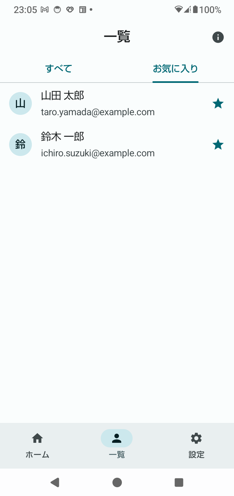
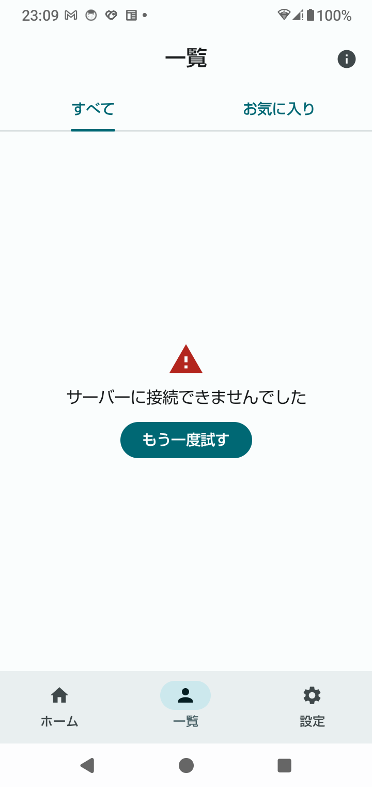
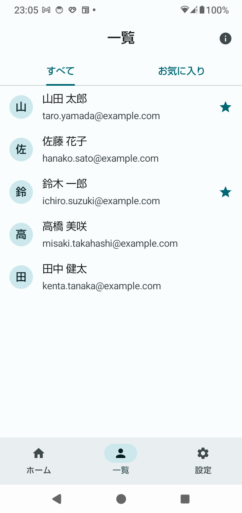
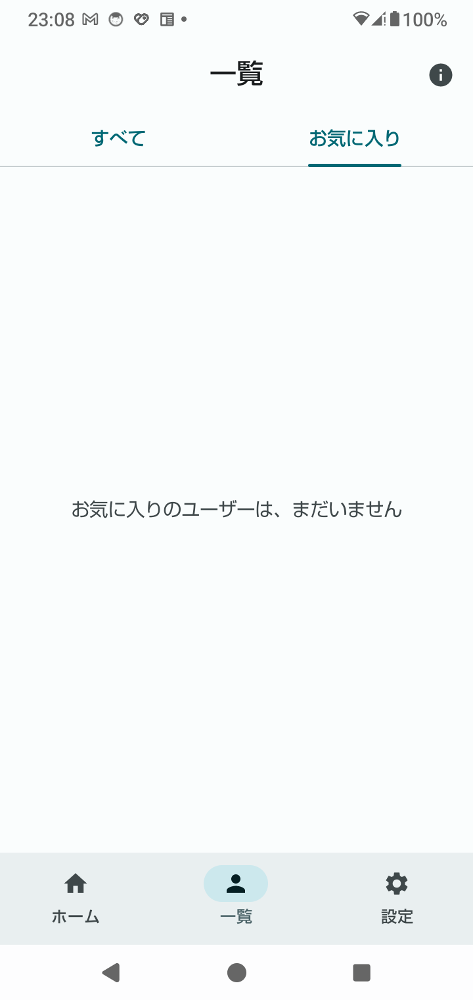
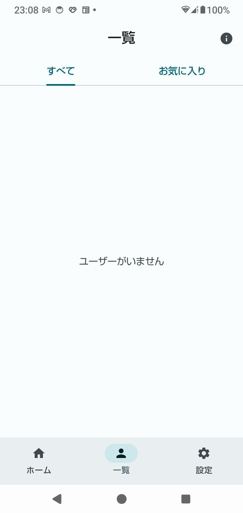

← 前: [04-横スクロールバナー.md](04-横スクロールバナー.md) ｜ [目次に戻る](../03-Compose画面設計解説.md) ｜ 次: [06-設定と仕上げ.md](06-設定と仕上げ.md) →

---

## Step 5：ユーザー一覧（タブ・LazyColumn・状態の表示）

ユーザー一覧に、**タブ**（すべて／お気に入り）と、**読み込み中・エラー・空**の表示を作ります。
ロードマップの「静的な見た目 → ユーザー操作 → **状態に応じた表示**」の、最後の段階です。

### 5-1. 何を作ったのか

```
ui/
├─ users/
│   ├─ UsersUiState.kt    ← 画面の状態（Loading / Success / Error）を表す型
│   ├─ UserListScreen.kt  ← タブ + LazyColumn + 状態ごとの表示（状態を受け取って表示するだけ）
│   ├─ UserListLoader.kt  ← 読み込みを実行し、状態を UserListScreen に渡す
│   └─ FakeUserApi.kt     ← 通信の代わりの、擬似的な読み込み（1.5秒待つ）
└─ model/Models.kt        ← User に isFavorite を追加
```

**「状態を持つ部品」（`UserListLoader`）と、「表示だけの部品」（`UserListScreen`）を分けています。**
表示だけの部品は、`@Preview` で、どんな状態でも、すぐに確認できます（5-6）。

### 5-2. 画面の状態を「型」で表す

```kotlin
sealed interface UsersUiState {
    data object Loading : UsersUiState                         // 読み込み中
    data class Success(val users: List<User>) : UsersUiState   // 読み込めた（0 件のこともある）
    data class Error(val message: String) : UsersUiState       // 失敗した
}
```

画面が取りうる姿を、**3つの型**で表します。

#### なぜ、Boolean（`isLoading`、`isError`）ではなく、型なのか

Boolean を並べる書き方だと、「読み込み中なのに、エラーでもある」のような、**ありえない組み合わせ**が書けてしまいます。
型なら、常に、3つのうちの**1つだけ**です。ありえない状態を、そもそも作れません。

#### `sealed interface` は、「種類は、これだけ」と決める

`when` で、状態ごとに表示を切り替えます。

```kotlin
when (state) {
    UsersUiState.Loading -> LoadingContent(…)
    is UsersUiState.Error -> ErrorContent(state.message, …)
    is UsersUiState.Success -> …
}
```

**`sealed` にすると、`when` で、全部の種類を書かないと、コンパイルエラーになります。**
実際に、`UsersUiState` に `data object Refreshing`（再読み込み中）を足すと、`when` を書いた2か所で、
次のエラーが出ました。

```
'when' expression must be exhaustive. Add the 'Refreshing' branch or an 'else' branch.
```

種類を足したとき、**書き忘れている画面を、コンパイラが全部教えてくれます**（課題5）。

| 部分 | 意味 |
|---|---|
| `data object Loading` | 中身を持たない、1つだけの状態 |
| `is UsersUiState.Error ->` | 「Error 型かどうか」を調べる。Error 型だと分かった後は、`state.message` が使える（スマートキャスト） |

### 5-3. `LazyColumn` — 見えている行だけを作る

```kotlin
LazyColumn(modifier = Modifier.fillMaxWidth()) {
    items(items = users, key = { it.id }) { user ->
        UserRow(user)
    }
}
```

Step 2 の「`Column` + `verticalScroll` + `forEach`」は、**見えない行まで、全部作ってしまいます**。
`LazyColumn` は、**画面に見えている行（と、その少し先）だけ**を作ります。

#### 実機で数えた結果（SH-51C・Android 14）

ユーザーを **1000件**にして、行が作られた数を、ログで数えました（確認用に、一時的に足したログです）。

| 操作 | 作られた行の数 |
|---|---|
| 一覧を開いた直後 | **9行**（1000件のうち） |
| 5回スワイプした後（先頭の行が「ユーザー 84」） | 新しく作られたのは **84行** |

`Column` なら、開いた時点で 1000 行が作られます。**`LazyColumn` は、スクロールした分だけ、作ります。**
SwiftUI の `List` が、見えている行だけを作るのと同じです。

- **`key = { it.id }`** は、行を「位置」ではなく「id」で見分ける指定です。データの並びが変わっても（先頭に追加されるなど）、
  行ごとの状態が混ざらず、動きも自然になります。
- **`LazyColumn` を、`verticalScroll` の中に入れてはいけません。** 縦に動く部品を、縦に動く部品の中に入れると、
  高さが決まらず、実行時にエラーになります（一般的な注意です。このプロジェクトでは試していません）。
  1つの画面には、縦にスクロールする部品を、1つだけ置きます。

#### API のデータを出すときは — 「表示の遅延」と「取得」は別

実際のアプリでは、一覧のデータは、API から取ってきます（記事のタイトル、サブタイトル、サムネイル画像、記事ID など）。
そのとき、次の2つを分けて考えます。

**`LazyColumn` が遅延させるのは、「表示」だけです。** 見えている行だけを**作る**仕組みです。
データの**取得**は、別の話です。1000件を1回の通信で取っていたら、通信は、もう終わっています。

| 対策 | 何を減らすか | 使うもの |
|---|---|---|
| 見えている行だけを作る | 画面に出す行（メモリ・描画） | `LazyColumn` |
| ページ単位で取る | 通信で取る件数（通信量・時間） | ページネーション、Paging 3 |

実務では、**両方**をやります。

##### 記事リストの API は、1回か、ページ単位か

**API の仕様次第**です。ページに対応していれば、件数が増えうる一覧は、**ページ単位**で取るのが一般的です。
（1回で全部取るのは、件数が少なく、増えないときだけです）

| 方式 | リクエストの例 | 特徴（一般的な知識です） |
|---|---|---|
| 一度に全部 | `GET /articles` | 簡単。件数が少なく、増えないときだけ |
| ページ番号 | `GET /articles?page=2&size=20` | 分かりやすい。新着が増えると、ずれて重複や抜けが出ることがある |
| カーソル | `GET /articles?after=最後のID` | 新着が増えても安定。記事のような一覧に向く |

**ユーザーが一番下の近くまでスクロールしたら、次のページを取る**のが「無限スクロール」です。

Android での実現方法は、2つあります。

**① 自前で作る。** ViewModel が、次のページの位置と、取得済みのリストを持ちます。
状態は、`UsersUiState` を広げます（「追加読み込み中」「追加の失敗」が増える）。
`sealed interface` なので、増やした種類を書き忘れると、コンパイルエラーで気づけます（課題5）。

**② Paging 3 ライブラリ（`androidx.paging`）を使う。** 公式ドキュメントに、`LazyColumn` との組み合わせ方があります。

```kotlin
val lazyPagingItems = pager.flow.collectAsLazyPagingItems()

LazyColumn {
    items(lazyPagingItems.itemCount, key = lazyPagingItems.itemKey { it.id }) { index ->
        val article = lazyPagingItems[index]
        if (article != null) ArticleRow(article) else ArticlePlaceholder()   // 読み込み前は、枠を表示
    }
}
```

- 最後の方まで来たら、**次のページの取得を、ライブラリが自動でやります**。
- 読み込み中・失敗・再試行の状態も、ライブラリが持っています。
- `paging-compose` の最新の安定版は **3.5.1** です（2026-09 時点、Google Maven で確認）。

**学習の順序としては、最初は「一度に取得」→ 慣れたら Paging 3** がおすすめです。

##### 画像は、表示するときに取得する

- API のレスポンスには、画像の**バイナリ**ではなく、**URL**（`"thumbnailUrl": "https://…"`）が入ります。
- 画像は、その行が**画面に出るとき**に、URL から読み込みます。`LazyColumn` は、見えている行だけを作る
  （5-3 の実測で9行）ので、**見えている行の画像だけが、リクエスト**されます。相性が良い仕組みです。

**Compose 標準では、URL の画像を表示できません。** Step 4 の `painterResource` は、アプリ内の画像用です。
URL の画像には、ライブラリの **Coil** を使うのが一般的です。

```kotlin
AsyncImage(
    model = article.thumbnailUrl,
    contentDescription = null,
    contentScale = ContentScale.Crop,
    modifier = Modifier.size(64.dp).clip(RoundedCornerShape(8.dp)),
)
```

| 項目 | 内容（公式ドキュメントで確認） |
|---|---|
| 依存 | `coil-compose` と、**`coil-network-okhttp`**（Coil 3 は、通信の部品が別。入れ忘れると URL の画像が読めない） |
| 最新の安定版 | 3.6.3（Maven Central で確認） |
| キャッシュ | **メモリキャッシュ + ディスクキャッシュ**。同じ画像を再び表示するときは、通信せずに、すぐ出る |
| リクエストの管理 | 自動（画面から消えた行の読み込みは、中止される） |
| 縮小 | 表示するサイズに合わせて縮小して読み込む（メモリの節約） |
| 設定例 | 公式の設定例では、メモリキャッシュが 25%、ディスクキャッシュが 2% |

- **キャッシュは、自動で効きます。** 自分で作る必要は、ありません。
- Coil 3 は、サーバーの `Cache-Control`（有効期限の指定）を、**標準では尊重しません**。
  サーバーの指定を効かせたいときは、設定が要ります。
- 読み込み前と失敗時の表示（`placeholder`、`error`）も、指定できます。
  画像にも、「読み込み中・成功・失敗」の状態がある、ということです（5-2 と同じ考え方）。
- サムネイルは、**小さな画像の URL**を API に返してもらうのが、通信量の点で有利です（一般的な知識です）。
- 画像の説明（`contentDescription`）は、記事のタイトルが、すぐ横に表示されていれば、`null` で構いません（Step 4 と同じ考え方）。

> **⚠️ このプロジェクトでは、Paging 3 も Coil も、まだ導入していません。** 上のコードは、書き方のイメージです
> （ビルドも、実機での確認もしていません）。公式ドキュメントと、Maven の情報を確認して書きました。

**このプロジェクトでの位置づけ：**

| Phase | 内容 |
|---|---|
| Phase 3 | 状態を ViewModel に移す（今の `UserListLoader` の中身） |
| Phase 5 | Retrofit で `GET /users` を呼び、通信中・成功・失敗を表示する（Step 5 の `UsersUiState` を、そのまま使える） |
| 発展 | 記事のような一覧（ページ単位、URL の画像）は、Phase 5 のあと |

### 5-4. タブ — `PrimaryTabRow`

```kotlin
PrimaryTabRow(selectedTabIndex = selectedTab.ordinal) {
    UserTab.entries.forEach { tab ->
        Tab(
            selected = tab == selectedTab,
            onClick = { onTabSelected(tab) },
            text = { Text(tab.label) },
        )
    }
}
```

```kotlin
enum class UserTab(val label: String, val emptyMessage: String) {
    All("すべて", "ユーザーがいません"),
    Favorites("お気に入り", "お気に入りのユーザーは、まだいません"),
}
```

- **タブの名前と、0 件のときのメッセージを、enum にまとめています。** タブを足すときは、enum に1行足します。
- **選んでいるタブは、引数で受け取ります**（`selectedTab`、`onTabSelected`）。表示だけの部品は、状態を持ちません。
- **タブは、どの状態のときも表示します。** 読み込み中でも、失敗しても、タブは動きません
  （タブが消えたり出たりすると、画面がガタつきます）。
- **タブが多いとき**は、横にスクロールできる `ScrollableTabRow` を使います（ロードマップ 5-1）。
- タブを、横スワイプでも切り替えたいときは、Step 4 の `HorizontalPager` と組み合わせます（今回は作りません）。

**「お気に入り」タブは、読み込んだユーザーを、絞り込むだけです。**

```kotlin
val shown = when (selectedTab) {
    UserTab.All -> state.users
    UserTab.Favorites -> state.users.filter { it.isFavorite }
}
```

「お気に入り」タブに絞り込んだ、実機の表示です。星の付いた2人だけが残っています。



### 5-5. 状態ごとの表示

| 状態 | 表示 | 作りで気をつけたこと |
|---|---|---|
| Loading | くるくる（`CircularProgressIndicator`）+ 「読み込み中…」 | **文字を付ける**。何を待っているのか伝わる |
| Error | 警告アイコン + メッセージ + **「もう一度試す」ボタン** | **失敗の表示には、必ず、次の行動を付ける**。ボタンが無いと、画面を開き直すしかなくなる |
| Success（0 件） | 「ユーザーがいません」 / 「お気に入りのユーザーは、まだいません」 | タブごとに、メッセージを変える |
| Success（あり） | 一覧。お気に入りには、星 | — |

実機の、それぞれの状態です。

| Loading | Error | Success（あり） | Success（お気に入りが0件） |
|---|---|---|---|
|  |  |  |  |

### 5-6. 画面は「状態を受け取って表示するだけ」— だから Preview で全部見える

```kotlin
@Composable
fun UserListScreen(
    state: UsersUiState,
    selectedTab: UserTab,
    onTabSelected: (UserTab) -> Unit,
    onRetry: () -> Unit,
    modifier: Modifier = Modifier,
)
```

`UserListScreen` は、**状態・選んだタブ・イベントを、全部、引数で受け取る**だけです（stateless）。
だから `@Preview` では、どんな状態でも、引数を渡すだけで、すぐに表示できます。

```kotlin
UserListScreen(state = UsersUiState.Loading, selectedTab = UserTab.All, onTabSelected = {}, onRetry = {})
UserListScreen(state = UsersUiState.Error("サーバーに接続できませんでした"), …)
```

`UserListScreen.kt` には、次の Preview を用意しています。

| Preview | 見ること |
|---|---|
| 通常 | 一覧と、星 |
| お気に入りタブ | 絞り込み |
| 長い文字列 | 名前とメールが「…」に省略される |
| 空状態（お気に入りが 0 件） | タブごとのメッセージ |
| 空状態（ユーザーが 0 件） | 全体が空のとき |
| **読み込み中** | くるくる |
| **エラー** | メッセージと、ボタン |
| ダーク | ダークモード |

**「読み込み中」と「エラー」は、実機では、待ったり、わざと失敗させたりしないと見られません。**
Preview なら、すぐに、見た目を調整できます。これが、状態を引数で受け取る作りの利点です。

### 5-7. 擬似的な読み込み — `LaunchedEffect` と `suspend`

実機で、「読み込み中」と「エラー」を見るために、**通信の代わりの、擬似的な読み込み**を作りました。
本物の通信は Phase 5 で作ります。

```kotlin
object FakeUserApi {
    val simulateError: Boolean = false           // true にすると、必ず失敗する（課題2）

    suspend fun fetchUsers(): List<User> {
        delay(1500)                              // 1.5秒待つ
        if (simulateError) throw IOException("サーバーに接続できませんでした")
        return SampleData.users
    }
}
```

```kotlin
@Composable
fun UserListLoader(modifier: Modifier = Modifier) {
    var reloadCount by remember { mutableIntStateOf(0) }
    var state by remember { mutableStateOf<UsersUiState>(UsersUiState.Loading) }
    var selectedTabIndex by rememberSaveable { mutableIntStateOf(0) }

    LaunchedEffect(reloadCount) {                // ← reloadCount が変わるたびに、最初から実行
        state = UsersUiState.Loading
        state = try {
            UsersUiState.Success(FakeUserApi.fetchUsers())
        } catch (e: IOException) {
            UsersUiState.Error(e.message ?: "読み込みに失敗しました")
        }
    }

    UserListScreen(
        state = state,
        selectedTab = UserTab.entries[selectedTabIndex],
        onTabSelected = { selectedTabIndex = it.ordinal },
        onRetry = { reloadCount++ },             // 「もう一度試す」→ 数字を増やす → 読み込みをやり直す
        modifier = modifier,
    )
}
```

| 部品 | 役割 |
|---|---|
| `suspend fun` | 「時間がかかる処理」の印。コルーチン（下の `LaunchedEffect` の中など）からしか呼べない |
| `delay(1500)` | スレッドを止めずに、1.5秒待つ |
| `LaunchedEffect(キー)` | キーが変わるたびに、中の処理を**最初から**実行する。SwiftUI の `.task(id:)` に近い |
| `reloadCount++` | 「もう一度試す」が押されたら、数字を増やす。数字が変わると、`LaunchedEffect` がやり直される |

#### 画面を離れると、読み込みは、自動でキャンセルされる

`LaunchedEffect` の処理は、その画面が消えると、**自動でキャンセルされます**。
実機で、5秒かかる読み込みの途中で、別のタブに移ったところ、`[Load] 結果` のログは、出ませんでした。
「読み込み中に、別の画面へ移っても、安全」です（課題3）。

#### 捕まえるのは `IOException` だけ

```kotlin
} catch (e: IOException) {          // ✅ 失敗（通信できなかった）だけを捕まえる
```

`Exception` を丸ごと捕まえると、コルーチンの**キャンセル**（`CancellationException`）まで捕まえてしまい、
キャンセルが効かなくなります。**捕まえるのは、想定している失敗の種類だけ**にします。

### 5-8. 実機のログで見る、読み込みの流れ

一覧を開いたときの、実際のログです（`[Load]` は、`UserListLoader` が出しています）。

```
15:45:42.050  [Compose] XrStudyApp
15:45:42.083  [Nav] 宛先が変わった → UsersRoute
15:45:42.112  [Compose] UserListScreen           ← ① 読み込み中の画面
15:45:42.188  [Load] 読み込み開始
15:45:43.696  [Load] 結果 → Success（5件）        ← 約1.5秒後
15:45:43.708  [Compose] UserListScreen           ← ② 成功の画面（状態が変わったので、作り直し）
```

**状態が変わる（`Loading` → `Success`）と、それを読んでいる `UserListScreen` が、作り直されます。**
Phase 1 の「状態が変わると、それを読む部分だけが再描画される」が、ここでも起きています。

エラーにしたとき（課題2）と、「もう一度試す」を押したときのログです。

```
15:48:19.151  [Load] 読み込み開始
15:48:20.658  [Load] 結果 → Error（サーバーに接続できませんでした）
15:48:25.446  [Load] 読み込み開始                   ← 「もう一度試す」を押した
15:48:26.957  [Load] 結果 → Error（サーバーに接続できませんでした）
```

### 5-9. ⚠️ `remember` の限界 — 読み込みが、何度もやり直される

`UserListLoader` は、`state`（読み込みの結果）を、`remember` で持っています。
**Phase 1 で学んだとおり、`remember` は、回転や、画面を離れたときに、消えます。**
実機で確認しました。

| 操作 | 読み込み | 選んだタブ | 一覧のスクロール位置 |
|---|---|---|---|
| ホームに移って、一覧に戻る | **やり直し**（`[Load] 読み込み開始` が、また出る） | **残る**（お気に入りのまま） | **残る**（1000件で「ユーザー 84」のまま） |
| 端末を回転させる | **やり直し** | **残る** | （確認していない） |

- **選んだタブが残るのは、`rememberSaveable` で持っているためです**（消えると困る、小さな値）。
- **読み込みの結果が消えるのは、`remember` で持っているためです**（Phase 1 の ① と同じ）。
- **スクロール位置が残るのは、`LazyColumn` の位置が、`rememberSaveable` で保存されるためです**
  （Step 3 の `saveState` / `restoreState` で、タブごとに保存・復元されます）。

**「読み込んだデータを、回転や画面移動をまたいで持つ」のは、ViewModel の役目**です（Phase 1 の ③）。
Phase 3 で、`UserListLoader` の中身を、ViewModel に移します。今の `remember` は、それまでの、仮のものです。

### 5-10. 実機で確認した結果

SH-51C（Android 14）で確認しました。

| 確認したこと | 結果 |
|---|---|
| 一覧を開く | 「読み込み中…」→ 約1.5秒後に、5人が表示された。お気に入りの2人に、星 |
| 「お気に入り」タブ | 2人に絞り込まれた |
| エラー（一時的に、失敗させた） | 警告アイコン、メッセージ、「もう一度試す」が表示された |
| 「もう一度試す」 | 読み込みが、やり直された |
| 読み込み中に、別のタブへ移る | 読み込みが、キャンセルされた（`[Load] 結果` が出ない） |
| 1000件 | 最初に作られた行は 9 行。5回スワイプで、新しく作られたのは 84 行 |
| タブ移動・回転 | 選んだタブは残り、読み込みは、やり直しになった |
| `when` の網羅性 | 種類を足すと、`when` の2か所が、コンパイルエラーになった |

エラー、1000件、5秒の読み込みは、コードを一時的に書き換えて確認しました。書き換えは、元に戻してあります。

| 長い文字列 | ユーザーが0件 |
|---|---|
|  |  |

### 5-11. iOS との比較

| 観点 | iOS（SwiftUI） | Android（Compose） |
|---|---|---|
| 状態の型 | 関連値を持つ `enum`（`case loaded([User])` など） | `sealed interface` |
| 状態ごとの切り替え | `switch`（全ケースを書かないとエラー） | `when`（全部の種類を書かないとエラー） |
| 一覧 | `List`（見えている行だけを作る） | `LazyColumn` |
| 読み込み中の表示 | `ProgressView` | `CircularProgressIndicator` |
| 画面が出たときに読み込む | `.task { … }` / `.task(id:)` | `LaunchedEffect(キー) { … }` |
| 待つ処理 | `async` 関数 + `Task.sleep` | `suspend` 関数 + `delay` |
| 画面を離れたときの中断 | `.task` が自動でキャンセルされる | `LaunchedEffect` が自動でキャンセルされる |
| タブ | `Picker`（`.segmented`）、`TabView` | `TabRow`（`PrimaryTabRow`） |

---

## 手を動かして確かめる（Step 5）

### 課題1：状態ごとの Preview を見る（5分）

Android Studio で `users/UserListScreen.kt` を開き、Preview の**「読み込み中」「エラー」「空状態」**を見てください。
実機で、待ったり、失敗させたりしなくても、見た目を確認できます。

### 課題2：エラーを起こす（5分）※戻すこと

`FakeUserApi.kt` の `simulateError` を `true` にします。

```kotlin
val simulateError: Boolean = true      // false から変更
```

アプリを入れ直して、「一覧」を開きます。

- 約1.5秒後に、**警告アイコン、メッセージ、「もう一度試す」ボタン**が表示される
- 「もう一度試す」を押す → **読み込み中に戻り、また失敗する**

```bash
adb logcat -s LIFECYCLE
```

で、`[Load] 読み込み開始` と `[Load] 結果 → Error（…）` が、ボタンを押すたびに出ることも、確認してください。
確認したら、`false` に戻してください。

### 課題3：読み込み中に、別の画面へ移る（5分）※戻すこと

`FakeUserApi.kt` の `LOADING_MILLIS` を、`5000L` に変えます（5秒）。

1. 「一覧」を開く（読み込み中になる）
2. すぐに「ホーム」へ移って、7秒ほど待つ
3. ログに、`[Load] 結果` が**出ない**ことを確認する（読み込みが、キャンセルされた）

確認したら、`1500L` に戻してください。

### 課題4：`LazyColumn` が作る行を数える（10分）※戻すこと

1. `FakeUserApi.kt` の `return` を、1000件に変えます。

   ```kotlin
   return List(1000) { User(it + 1, "ユーザー ${it + 1}", "user${it + 1}@example.com") }
   ```

2. `UserListScreen.kt` の `UserRow` の先頭に、ログを足します。

   ```kotlin
   Log.d("LIFECYCLE", "[Row] ${user.id}")
   ```

3. 一覧を開き、`[Row]` のログを数える → **10行前後**（1000行ではない）
4. スワイプすると、`[Row]` が、スクロールした分だけ増える

確認したら、両方を元に戻してください。

### 課題5：`when` の網羅性を確かめる（3分）※戻すこと

`UsersUiState.kt` に、種類を1つ足します。

```kotlin
data object Refreshing : UsersUiState
```

ビルドすると、`UserListScreen.kt` と `UserListLoader.kt` の `when` が、
**`'when' expression must be exhaustive`** というエラーになります。
`else` を使わずに、`Refreshing` の分岐を足すと、エラーが消えます。

確認したら、`Refreshing` を消してください。

### 課題6：回転と、タブ移動を確かめる（5分）

1. 「お気に入り」タブを選ぶ
2. 端末を回転させる → **「お気に入り」のまま**。ただし、`[Load] 読み込み開始` が、もう一度出る
3. ホームに移って、一覧に戻る → **「お気に入り」のまま**。ただし、また読み込みが始まる

「選んだタブ」（`rememberSaveable`）は残り、「読み込みの結果」（`remember`）は消えることを、確認してください。
Phase 3 で、後者を ViewModel に移すと、読み込みのやり直しがなくなります。

---

← 前: [04-横スクロールバナー.md](04-横スクロールバナー.md) ｜ [目次に戻る](../03-Compose画面設計解説.md) ｜ 次: [06-設定と仕上げ.md](06-設定と仕上げ.md) →
