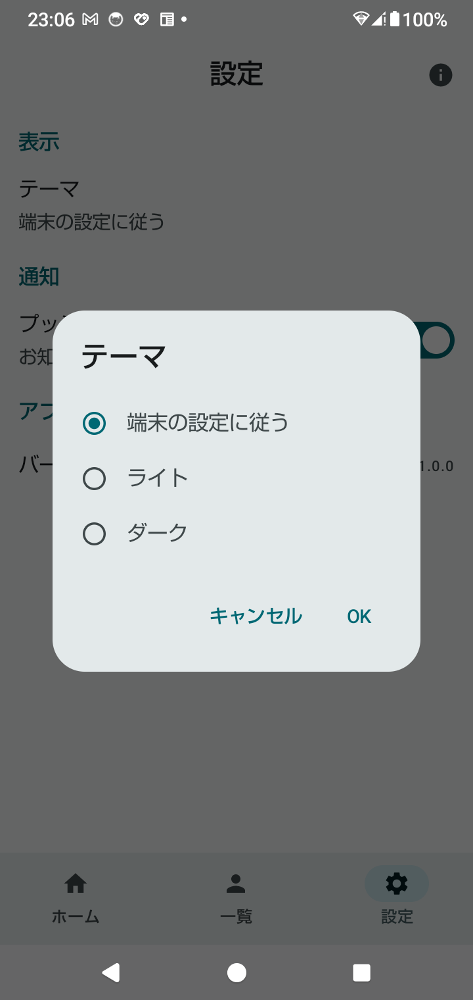
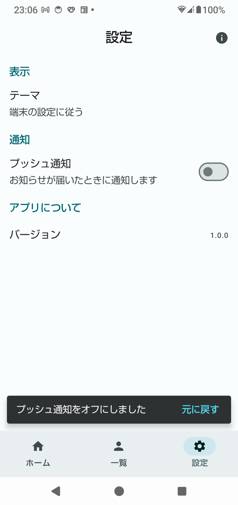
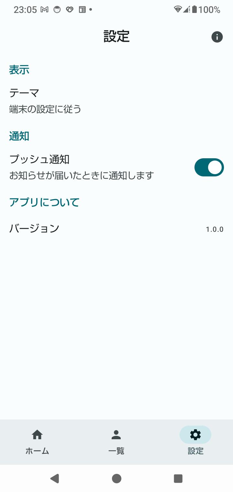
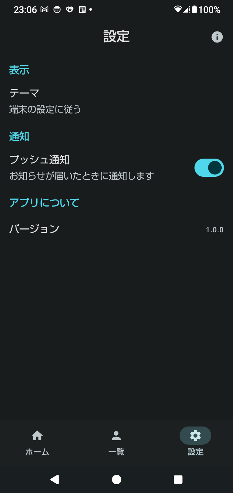

← 前: [05-ユーザー一覧.md](05-ユーザー一覧.md) ｜ [目次に戻る](../03-Compose画面設計解説.md) ｜ 次: [07-起動から表示までの流れ.md](07-起動から表示までの流れ.md) →

---

## Step 6：設定と仕上げ（ダイアログ・Snackbar・テーマ切り替え・アクセシビリティ）

Step 2 から「見た目だけ」だった設定画面を、**押すと動く**ようにします。
ロードマップの「`Scaffold`、Top App Bar、Snackbar、ダイアログを使い、**操作へのフィードバックを表示する**」と、
「`contentDescription`、十分なタップ領域、**文字が大きい場合の崩れを確認する**」が、この Step の内容です。

### 6-1. 何を作ったのか

```
MainActivity.kt                ← テーマの選び方を持つ。バーのアイコンの色を、テーマに合わせる
ui/
├─ theme/
│   ├─ ThemeMode.kt            ← 新規：テーマの選び方（端末の設定／ライト／ダーク）
│   └─ Color.kt                ← Snackbar の色（inverseSurface など）を追加
├─ settings/SettingsScreen.kt  ← テーマの行とダイアログ、押せるスイッチ
├─ XrStudyApp.kt               ← Snackbar の置き場所（SnackbarHost）と、通知の設定を持つ
└─ users/UserListScreen.kt     ← アバターの1文字を、読み上げから外す
```

| 操作 | 何が起きるか |
|---|---|
| 「テーマ」の行を押す | ダイアログが開く。「端末の設定に従う／ライト／ダーク」から選び、「OK」で反映 |
| 「プッシュ通知」の行を押す | スイッチが切り替わり、画面の下に「プッシュ通知をオフにしました ［元に戻す］」 |
| 「元に戻す」を押す | スイッチが、押す前に戻る |

プッシュ通知は、**スイッチの見た目と状態だけ**です。本当の通知は送りません。

### 6-2. 状態は「使う部品より、上」で持つ — どこに置いたか

この Step で増えた状態は4つです。**置き場所が、それぞれ違います。**

| 状態 | 置き場所 | 理由 |
|---|---|---|
| テーマの選び方（`themeMode`） | `MainActivity`（`setContent` の中） | `XRStudyTheme` に渡すため、**テーマより上**で持つ必要がある |
| プッシュ通知のオン／オフ | `XrStudyApp` | Snackbar の「元に戻す」から、戻せる場所に置く（6-5） |
| Snackbar の状態（`SnackbarHostState`） | `XrStudyApp` | `Scaffold` と同じ場所。下部ナビのすぐ上に出してもらうため（6-5） |
| ダイアログを開いているか | `SettingsScreen` | 設定画面の中だけで使う、見た目の状態 |

```
MainActivity（setContent）
  themeMode ────────────┐
  XRStudyTheme(darkTheme)│
    XrStudyApp           ↓ 引数で渡す
      notificationsEnabled、snackbarHostState
      Scaffold
        SettingsScreen(themeMode, notificationsEnabled, onThemeModeChange, onNotificationsChange)
          showThemeDialog（ここだけで使う）
```

**原則は「その状態を使う部品のうち、一番上の部品で持つ」**です（Phase 1 の state hoisting と同じ）。
テーマは、アプリ全体の色を決めるので、一番上です。
ダイアログの開閉は、設定画面しか知らなくてよいので、設定画面の中です。

設定画面は、Step 5 の `UserListScreen` と同じく、**値と処理を、引数で受け取るだけ**です。
だから `@Preview` で、「ダーク・通知オフ」のような組み合わせも、値を渡すだけで確認できます。

### 6-3. テーマの切り替え

#### テーマの選び方は、Boolean ではなく enum

```kotlin
enum class ThemeMode(val label: String) {
    System("端末の設定に従う"),
    Light("ライト"),
    Dark("ダーク"),
}

@Composable
fun ThemeMode.isDark(): Boolean = when (this) {
    ThemeMode.System -> isSystemInDarkTheme()   // 端末の設定を読む
    ThemeMode.Light -> false
    ThemeMode.Dark -> true
}
```

`isDark: Boolean` で持つと、「ライト」「ダーク」の2つしか表せず、**「端末の設定に従う」が表せません**。
Step 5 の `UsersUiState` と同じ考え方で、「ありうる選択肢」を、型で決めています。

#### `MainActivity` で持って、`XRStudyTheme` に渡す

```kotlin
setContent {
    var themeMode by rememberSaveable { mutableStateOf(ThemeMode.System) }
    val darkTheme = themeMode.isDark()

    XRStudyTheme(darkTheme = darkTheme) {
        XrStudyApp(
            themeMode = themeMode,
            onThemeModeChange = { themeMode = it },
        )
    }
}
```

Step 1 の `XRStudyTheme` は、はじめから `darkTheme` を引数で受け取れるように作ってありました（初期値が `isSystemInDarkTheme()`）。
ここに、選んだ値を渡すだけです。

**テーマを切り替えても、Activity は作り直されません。** 実機のログでは、「OK」を押したあと、次の3行だけが出ました。

```
[Compose] XRStudyTheme
[Compose] XrStudyApp
[Compose] SettingsScreen
```

`onCreate` は出ていません。`themeMode` が変わり、それを読んでいる部品が、**再組み立て（recomposition）**されただけです。
端末の設定でダークモードを切り替えたときは、Activity が作り直されます（設定変更。回転と同じ）。
アプリの中で切り替えるほうが、軽い処理です。

#### ⚠️ `rememberSaveable` なので、アプリを終了すると、元に戻る

| 操作 | テーマ |
|---|---|
| 回転 | **残る**（`rememberSaveable`） |
| ほかのタブへ移って、戻る | **残る**（`MainActivity` で持っているので、そもそも消えない） |
| アプリを終了して、起動し直す | **「端末の設定に従う」に戻る** |

実機で、`adb shell am force-stop` のあと起動し直すと、「端末の設定に従う」に戻りました。
**終了しても設定を残すのは、DataStore の役目**です（ロードマップの Phase 4）。今は、そこまでは作りません。

### 6-4. ダイアログ — `AlertDialog`

```kotlin
var showThemeDialog by rememberSaveable { mutableStateOf(false) }

ListItem(
    headlineContent = { Text("テーマ") },
    supportingContent = { Text(themeMode.label) },
    modifier = Modifier.clickable(onClickLabel = "テーマを選ぶ", role = Role.Button) {
        showThemeDialog = true                   // ← 開く
    },
)

if (showThemeDialog) {                           // ← true の間だけ、ダイアログが存在する
    ThemeDialog(
        current = themeMode,
        onConfirm = { selected ->
            onThemeModeChange(selected)
            showThemeDialog = false              // ← 閉じる
        },
        onDismiss = { showThemeDialog = false }, // ← 閉じる（何も変えない）
    )
}
```

「テーマ」の行を押して開いた、実機のダイアログです。



#### ★ ダイアログは「状態」で出す。`show()` という命令はない

View の時代や iOS の UIKit では、「ダイアログを表示する」という**命令**を呼んでいました。
Compose では、**「開いているか」という状態**を持ち、`true` の間だけ、ダイアログを組み立てに含めます。
SwiftUI の `.alert(isPresented: $showAlert)` と同じ考え方です。

`rememberSaveable` にしているので、**ダイアログを開いたまま回転しても、開いたまま**です（実機で確認）。

#### 「OK」で反映し、それ以外は何も変えない

```kotlin
@Composable
private fun ThemeDialog(current: ThemeMode, onConfirm: (ThemeMode) -> Unit, onDismiss: () -> Unit) {
    var selected by rememberSaveable { mutableStateOf(current) }   // 選んでいる途中の値

    AlertDialog(
        onDismissRequest = onDismiss,            // ダイアログの外を押す・戻るボタン
        title = { Text("テーマ") },
        text = { /* ラジオボタン3つ。押すと selected が変わる */ },
        confirmButton = { TextButton(onClick = { onConfirm(selected) }) { Text("OK") } },
        dismissButton = { TextButton(onClick = onDismiss) { Text("キャンセル") } },
    )
}
```

| 閉じ方 | 呼ばれるもの | テーマ |
|---|---|---|
| 「OK」 | `onConfirm(selected)` | 選んだものに変わる |
| 「キャンセル」 | `onDismiss` | 変わらない |
| ダイアログの外を押す・戻るボタン | `onDismissRequest`（= `onDismiss`） | 変わらない |

**選んでいる途中の値（`selected`）は、ダイアログの中で持ちます。** 親の `themeMode` を直接書き換えると、
ラジオボタンを押しただけで、テーマが変わってしまい、「キャンセル」できません。
ダイアログが閉じると `selected` も消えるので、**次に開いたときは、また「今の設定」から始まります**。

選んだ時点で反映して閉じる作り（「OK」が無い）もあります。どちらにするかは、アプリの方針で決めます。
今回は、「キャンセル」の動きを学ぶため、「OK」で反映する作りにしました。

### 6-5. Snackbar — 操作の結果を、短く伝える

```kotlin
// XrStudyApp
val snackbarHostState = remember { SnackbarHostState() }
val scope = rememberCoroutineScope()
var notificationsEnabled by rememberSaveable { mutableStateOf(true) }

Scaffold(
    topBar = { … },
    bottomBar = { … },
    snackbarHost = { SnackbarHost(snackbarHostState) },   // ← Snackbar を出す場所
) { … }
```

```kotlin
// 設定画面で、通知のスイッチが押されたとき
onNotificationsChange = { enabled ->
    notificationsEnabled = enabled
    scope.launch {
        snackbarHostState.currentSnackbarData?.dismiss()     // 表示中のものを閉じる（下で説明）
        val result = snackbarHostState.showSnackbar(
            message = if (enabled) "プッシュ通知をオンにしました" else "プッシュ通知をオフにしました",
            actionLabel = "元に戻す",
            duration = SnackbarDuration.Short,
        )
        if (result == SnackbarResult.ActionPerformed) {      // 「元に戻す」が押された
            notificationsEnabled = !enabled
        }
    }
}
```

| 部品 | 役割 |
|---|---|
| `SnackbarHostState` | 「今、どの Snackbar を出しているか」を持つ |
| `SnackbarHost` | Snackbar を実際に描く場所。`Scaffold` に渡すと、**下部ナビのすぐ上**に置いてくれる |
| `showSnackbar(…)` | `suspend` 関数。**Snackbar が消えるまで待って**、結果（`ActionPerformed` か `Dismissed`）を返す |
| `rememberCoroutineScope()` | `suspend` 関数を、ボタンを押したとき（イベント）から呼ぶための scope |

スイッチをオフにしたときの、実機の Snackbar です。下部ナビのすぐ上に、周りと逆の明るさ（6-6）で出ています。



#### `LaunchedEffect` ではなく、`rememberCoroutineScope`

Step 5 の読み込みは、「画面が出たら、始める」ので、`LaunchedEffect` でした。
Snackbar は、「**スイッチが押されたら**、出す」ので、押されたときの処理（`onClick` など）の中から始めます。
`onClick` の中は `@Composable` ではないので、`LaunchedEffect` は書けません。そこで `scope.launch { … }` を使います。

| 始めるきっかけ | 使うもの |
|---|---|
| 画面が表示されたとき・キーが変わったとき | `LaunchedEffect(キー)` |
| ボタンが押されたときなど（イベント） | `rememberCoroutineScope()` + `scope.launch` |

#### なぜ、Snackbar と通知の設定を `XrStudyApp` で持つのか

`showSnackbar` は、Snackbar が消えるまで（約4秒）待ちます。
もし、scope と通知の設定を**設定画面の中**で持つと、その4秒の間に別のタブへ移ったとき、設定画面が消え、

- scope がキャンセルされ、「元に戻す」の結果を受け取れない
- 通知の設定（`remember` の値）も、画面と一緒に消える

ことになります。`XrStudyApp` で持てば、タブを移っても、Snackbar も、その後の処理も、最後まで動きます。

#### ⚠️ 続けて押すと、Snackbar は「順番待ち」になる

`showSnackbar` は、表示中の Snackbar があると、**それが消えるまで待ってから**、次を出します。
何もしないと、スイッチを3回すばやく押したとき、Snackbar が1つずつ、**約4秒ごとに、合計12秒**出続けます。
そこで、出す前に `currentSnackbarData?.dismiss()` で、表示中のものを閉じています。

実機で、3回すばやく押したときのログです。

```
01:19:40.012 [Snackbar] 結果 → Dismissed    ← 1つ目：2回目を押したときに閉じられた
01:19:40.455 [Snackbar] 結果 → Dismissed    ← 2つ目：3回目を押したときに閉じられた
01:19:44.514 [Snackbar] 結果 → Dismissed    ← 3つ目：約4秒表示されて、消えた
```

最後のスイッチの状態（3回押したので、元の逆）が、そのまま残りました。

#### ボタン付きの Snackbar は、何も指定しないと消えない

`showSnackbar` の `duration` の初期値は、**ボタン（`actionLabel`）があると `Indefinite`（押されるまで消えない）**です。
「元に戻す」くらいの軽い操作で、消えない Snackbar は邪魔なので、`SnackbarDuration.Short` を指定しています。

なお、TalkBack などが有効なときは、Snackbar が表示される時間が、自動で長くなります（読み上げに時間がかかるため）。

#### Snackbar と、ダイアログ・Toast の使い分け

| 部品 | 使うとき | 例 |
|---|---|---|
| Snackbar | 操作の**結果**を、短く伝える。「元に戻す」を付けられる | 「削除しました ［元に戻す］」 |
| ダイアログ | 操作の**前**に、確認・選択してもらう。ほかの操作を止める | 「削除しますか？」、テーマを選ぶ |
| Toast | アプリの外（通知など）でも出せる、短い文字だけ。ボタンは付けられない | Compose の画面の中では、Snackbar を使う |

「元に戻す」があれば、「削除しますか？」の確認ダイアログを省けます。押す回数が減るので、よく使われる組み合わせです。

### 6-6. Snackbar の色 — `inverseSurface` を定義し忘れていた

最初に実機で出したとき、「元に戻す」の文字が、**紫色**でした。アプリの色（ティール）ではありません。

Snackbar は、周りと逆の明るさの色（**`inverse` の役割**）を使います。

| 役割 | Snackbar のどこ |
|---|---|
| `inverseSurface` | 背景 |
| `inverseOnSurface` | 文字 |
| `inversePrimary` | ボタン（「元に戻す」） |

`Color.kt` で、この3つを定義していなかったため、**Material の初期値（紫）**が使われていました。
Step 1 の「`surfaceContainer*` を定義した理由」と、同じ原因です。
3つを、ライトとダークの両方に追加して、ティールになりました。

**配色を手で置くときは、使っている部品が、どの役割を使うかを確認する必要があります。**
Material Theme Builder の出力を丸ごと貼れば、全部の役割が入っているので、この問題は起きません。

### 6-7. ⚠️ ステータスバーのアイコンの色を、アプリのテーマに合わせる

アプリの中で「ダーク」を選んでも、端末がライトモードのままだと、**ステータスバーのアイコンが黒いまま**になります。
実機で確認したところ、暗い背景に黒いアイコンが並んで、時計や電池がほとんど見えませんでした。
3ボタンのナビゲーションバーも、白い帯のまま残りました。

原因は、`onCreate` の `enableEdgeToEdge()` が、バーの色を**端末の設定**で決めているためです。
アプリのテーマが変わっても、それを知りません。

```kotlin
DisposableEffect(darkTheme) {                    // darkTheme が変わるたびに、実行し直す
    enableEdgeToEdge(
        statusBarStyle = SystemBarStyle.auto(
            AndroidColor.TRANSPARENT, AndroidColor.TRANSPARENT,
        ) { darkTheme },                         // ← 「ダークかどうか」を、アプリのテーマで答える
        navigationBarStyle = SystemBarStyle.auto(LightScrim, DarkScrim) { darkTheme },
    )
    onDispose {}
}
```

`SystemBarStyle.auto` の最後の `{ darkTheme }` は、「今ダークかどうか」を答える関数です。
初期値は「端末の設定を読む」なので、ここで、アプリの `darkTheme` を返すように差し替えています。

`DisposableEffect(キー)` は、`LaunchedEffect` の仲間で、「キーが変わったら、中を実行し直す」ものです。
`LaunchedEffect` との違いは、**コルーチンではない**ことと、**後片付け（`onDispose`）を書ける**ことです。
`enableEdgeToEdge` は `suspend` ではなく、すぐ終わる処理なので、こちらを使っています（片付けは不要なので空）。

### 6-8. アクセシビリティ — TalkBack と、押せる範囲

#### ★ スイッチだけでなく、「行全体」を押せるようにする

```kotlin
ListItem(
    headlineContent = { Text("プッシュ通知") },
    supportingContent = { Text("お知らせが届いたときに通知します") },
    trailingContent = { Switch(checked = checked, onCheckedChange = null) },   // ← Switch は押せない
    modifier = Modifier.toggleable(                                             // ← 行が押せる
        value = checked,
        role = Role.Switch,
        onValueChange = onCheckedChange,
    ),
)
```

| 書き方 | 押せる範囲 | TalkBack の読み上げ |
|---|---|---|
| ❌ `Switch(onCheckedChange = …)` だけ | スイッチの部分だけ | 「プッシュ通知」「お知らせが…」「スイッチ、オン」が**別々** |
| ✅ 行に `toggleable`、Switch は `null` | **行全体** | 「プッシュ通知、お知らせが…、スイッチ、オン」が**1回で** |

Switch にも処理を付けると、行とスイッチの2か所が「押せる部品」になり、読み上げが分かれます。
**押す処理は、行だけに付けます。** ラジオボタンの行（`selectable` + `RadioButton(onClick = null)`）も同じ形です。

実機の画面の情報（`uiautomator dump`）で、スイッチの行が、**行全体（高さ 126px = 72dp）で1つの「押せる・チェックできる」部品**になっていることを確認しました。
スイッチ単体は、押せる部品として出てきません。

#### `role` と `onClickLabel` — 何が起きるかを、読み上げで伝える

| 指定 | TalkBack が読み上げる内容（目安） |
|---|---|
| `role = Role.Switch` | 「スイッチ、オン」 |
| `role = Role.RadioButton` | 「ラジオボタン、選択済み」 |
| `role = Role.Button` + `onClickLabel = "テーマを選ぶ"` | 「ボタン、ダブルタップしてテーマを選ぶ」 |

`selectableGroup()` は、「この中から1つを選ぶ、ひとまとまり」だと伝える指定です。

読み上げの言い回しは、TalkBack のバージョンや端末で少し変わります。
この表は、**実機の TalkBack で聞いて確認したものではありません**（画面の情報を `uiautomator dump` で見た確認だけです）。
実際の読み上げは、課題6で確認してください。

#### 押せる範囲は、最低 48dp

Android の推奨は、**押せる範囲を 48dp × 48dp 以上**にすることです。
ダイアログのラジオボタンの行には、`heightIn(min = 48.dp)` を付けました。
実機（280dpi＝1dp が 1.75px）では、行の高さが 84px、つまり **48dp** でした。

`ListItem`、`NavigationBarItem`、`IconButton` などの Material の部品は、はじめから 48dp 以上あります。
自分で `Row` や `Box` に `clickable` を付けたときに、気を付けます。

#### 飾りは、読み上げから外す

ユーザー一覧のアバター（名前の1文字目の丸）に、`clearAndSetSemantics {}` を付けました。

```kotlin
Surface(
    shape = CircleShape,
    modifier = Modifier.size(40.dp).clearAndSetSemantics {},   // 読み上げから外す
) { Text(initial) }
```

外さないと、「山、山田 太郎、taro.yamada@…」のように、1文字目が余分に読まれます。
名前は、隣の文字で読まれるので、丸は飾りです。Step 4 のバナー画像を `contentDescription = null` にしたのと、同じ考え方です。

| 部品の種類 | 読み上げ |
|---|---|
| 意味を持つアイコン（戻る矢印、お気に入りの星） | `contentDescription` で、意味を書く |
| 隣の文字と同じ内容（下部ナビのアイコン、バナー画像） | `contentDescription = null` |
| 文字だが、飾り（アバターの1文字） | `clearAndSetSemantics {}` |

#### 文字を最大にしても、崩れないか

`@Preview` に `fontScale = 2f` を付けると、端末の「フォントサイズ」を最大にしたときの見た目を確認できます。

```kotlin
@Preview(name = "文字 200%", showBackground = true, heightDp = 640, fontScale = 2f)
```

実機でも、フォントサイズを 200% にして確認しました。

| 場所 | 結果 |
|---|---|
| 設定画面 | 説明文が2行に折り返し、行が高くなった。スイッチとは重ならない |
| テーマのダイアログ | 3つの選択肢と、ボタンが、すべて収まった |
| Snackbar | 文字が2行に折り返し、「元に戻す」とは重ならない |

Android 14 からは、文字が大きいほど、拡大の割合が小さくなります（**非線形の拡大**）。
200% でも、見出しのような大きな文字は、2倍にはなりません。本文のような小さな文字が、読みやすく大きくなります。

**文字の大きさを `sp` で指定し、高さを固定しない**（`height` ではなく、`heightIn(min = …)`）ことで、崩れを防げます。
Step 1 の「文字の単位は `sp`、それ以外は `dp`」が、ここで効いています。

### 6-9. 実機で確認した結果

SH-51C（Android 14、3ボタンナビゲーション）で確認しました。

| 確認したこと | 結果 |
|---|---|
| 「プッシュ通知」の説明文（スイッチではない所）を押す | スイッチが切り替わり、Snackbar が下部ナビのすぐ上に出た |
| 「元に戻す」 | スイッチが戻った（`[Snackbar] 結果 → ActionPerformed`） |
| 何もしない | 約4秒で消えた（`Dismissed`）。スイッチはそのまま |
| スイッチを3回すばやく押す | 古い Snackbar はすぐ閉じられ、最後の1つだけが約4秒出た |
| ダイアログで「ダーク」を選んで、回転 | ダイアログは開いたまま、「ダーク」の選択も残った |
| 「キャンセル」／戻るボタン | テーマは変わらなかった |
| 「ダーク」→「OK」 | アプリ全体がダークに。Activity は作り直されず、再組み立てだけ |
| ダークのまま回転 | ダークのまま |
| アプリを終了して、起動し直す | 「端末の設定に従う」に戻った（6-3） |
| `DisposableEffect` を一時的に外す | ステータスバーのアイコンが黒いまま、ナビゲーションバーが白い帯になった |
| フォントサイズ 200% | 崩れなし（6-8） |

`DisposableEffect` を外す確認と、フォントサイズの変更は、確認後に元に戻してあります。

「ダーク」を選んだあとの、設定画面です。

| ライト | ダーク |
|---|---|
|  |  |

### 6-10. iOS との比較

| 観点 | iOS（SwiftUI） | Android（Compose） |
|---|---|---|
| ダイアログ | `.alert(isPresented:)`、`.confirmationDialog` | `if (show) { AlertDialog(…) }` |
| 操作の結果を短く出す | 標準の部品は無い（自作するか、ライブラリ） | `Snackbar`（`Scaffold` の `snackbarHost`） |
| アプリだけダークにする | `.preferredColorScheme(.dark)` | `XRStudyTheme(darkTheme = true)` |
| ステータスバーの文字色 | `preferredColorScheme` に合わせて、自動で変わる | `enableEdgeToEdge` を、テーマに合わせて呼び直す |
| 設定を、終了しても残す | `@AppStorage`（UserDefaults） | DataStore（Phase 4） |
| 読み上げ | VoiceOver | TalkBack |
| 部品をまとめて読ませる | `.accessibilityElement(children: .combine)` | `toggleable` / `clickable` / `semantics(mergeDescendants = true)` |
| 読み上げから外す | `.accessibilityHidden(true)` | `clearAndSetSemantics {}`、`contentDescription = null` |
| 押せる範囲の推奨 | 44pt × 44pt | 48dp × 48dp |
| 文字の拡大 | Dynamic Type | フォントサイズ（`sp`）、Android 14 から非線形 |

---

## 手を動かして確かめる（Step 6）

### 課題1：設定画面の Preview を見る（5分）

Android Studio で `settings/SettingsScreen.kt` を開き、Preview の**「文字 200%」「ダーク」「テーマのダイアログ」**を見てください。
「文字 200%」では、説明文が折り返しても、スイッチと重ならないことを確認します。

### 課題2：Snackbar の結果を、ログで見る（5分）

```bash
adb logcat -s LIFECYCLE
```

1. 「プッシュ通知」の行を押す → 何もしないで待つ → `[Snackbar] 結果 → Dismissed`
2. もう一度押す → 「元に戻す」を押す → `[Snackbar] 結果 → ActionPerformed`、スイッチが戻る
3. 押してすぐ、「ホーム」タブへ移る → Snackbar は、ホームでも出たまま、約4秒で消える

3 で Snackbar が消えないのは、`SnackbarHost` と scope を、設定画面ではなく `XrStudyApp` で持っているためです。

### 課題3：`dismiss()` を外して、順番待ちを見る（5分）※戻すこと

`XrStudyApp.kt` の次の行を、コメントにします。

```kotlin
// snackbarHostState.currentSnackbarData?.dismiss()
```

スイッチを3回すばやく押すと、Snackbar が**1つずつ、約4秒ごとに**出てきます。
「オフにしました」「オンにしました」「オフにしました」と、古いメッセージが、後から順に出ることを確認してください。
確認したら、元に戻してください。

### 課題4：「OK」の無いダイアログにする（10分）※戻すこと

`SettingsScreen.kt` の `ThemeDialog` を、「選んだら、すぐ反映して閉じる」作りに変えてみます。

```kotlin
ThemeOptionRow(
    mode = mode,
    selected = mode == selected,
    onClick = { onConfirm(mode) },       // selected = mode から変更
)
```

`confirmButton` は必須の引数なので、残しておきます。
ラジオボタンを押した瞬間に、テーマが変わって閉じることを確認します。「キャンセル」は、選ぶ前にしか使えなくなります。
どちらの作りがよいか、考えてみてください。確認したら、元に戻してください。

### 課題5：ステータスバーの色を見比べる（5分）※戻すこと

端末をライトモードにしたまま、アプリで「ダーク」を選びます。ステータスバーの時計が**白い**ことを確認します。

次に、`MainActivity.kt` の `DisposableEffect(darkTheme) { … }` を、まるごとコメントにして、入れ直します。
同じ操作で、時計が**黒いまま**（暗い背景で見えにくい）になることを確認してください。
確認したら、元に戻してください。

### 課題6：TalkBack で読み上げを聞く（15分）

端末の「設定 → ユーザー補助 → TalkBack」をオンにします（操作が変わるので、先に止め方を確認してください。
多くの端末では、**音量ボタンの上下を、同時に3秒長押し**でオン／オフできます）。

TalkBack がオンのときは、**1回タップで読み上げ、2回タップで押す**、に変わります。

1. 設定画面で、「プッシュ通知」の行をタップ → 題名・説明・スイッチの状態が、**1回で**続けて読まれる
2. 「テーマ」の行をタップ → 「ダブルタップしてテーマを選ぶ」と読まれる
3. ダイアログのラジオボタン → 「ラジオボタン、選択済み」のように、状態が読まれる
4. ユーザー一覧の行 → 名前の1文字目（「山」など）が、**先に読まれない**

確認したら、TalkBack をオフにしてください。

---

← 前: [05-ユーザー一覧.md](05-ユーザー一覧.md) ｜ [目次に戻る](../03-Compose画面設計解説.md) ｜ 次: [07-起動から表示までの流れ.md](07-起動から表示までの流れ.md) →
