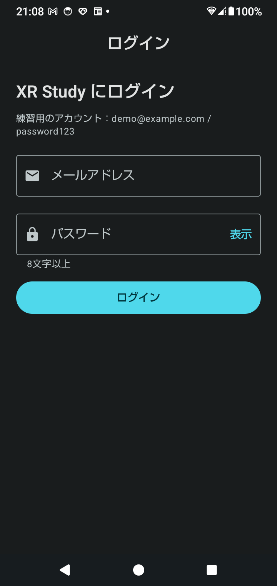
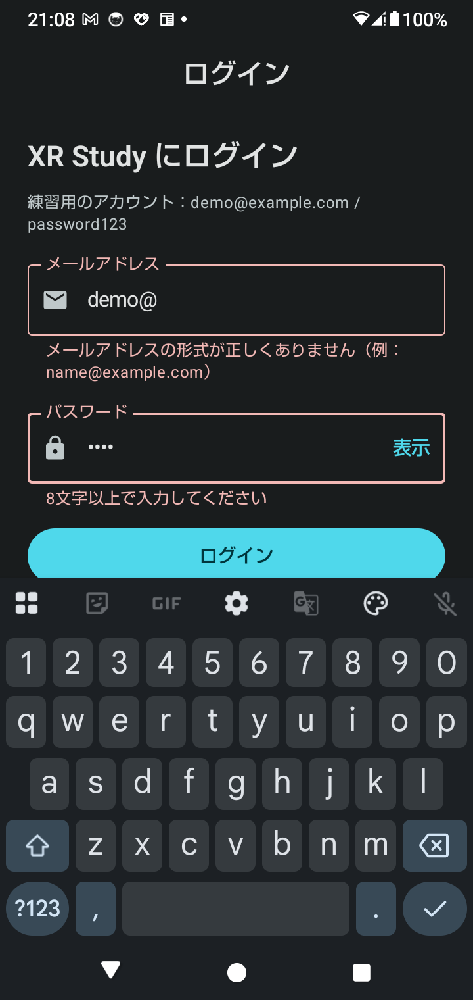
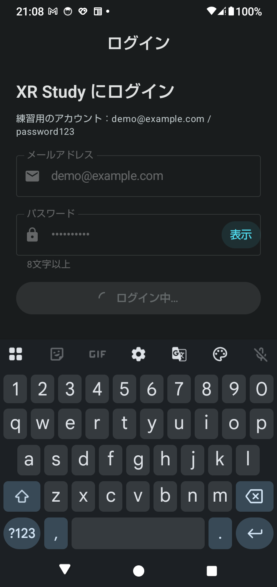
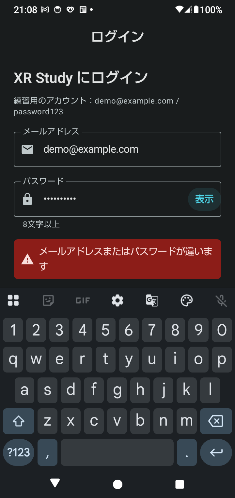
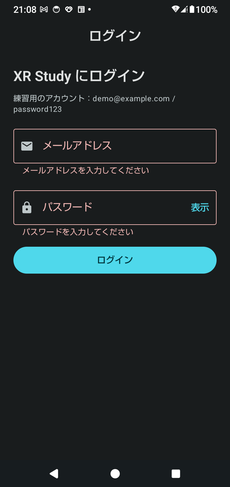
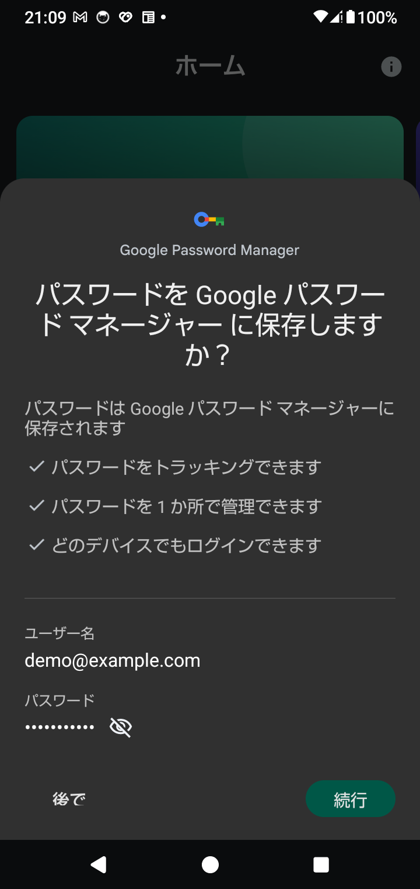
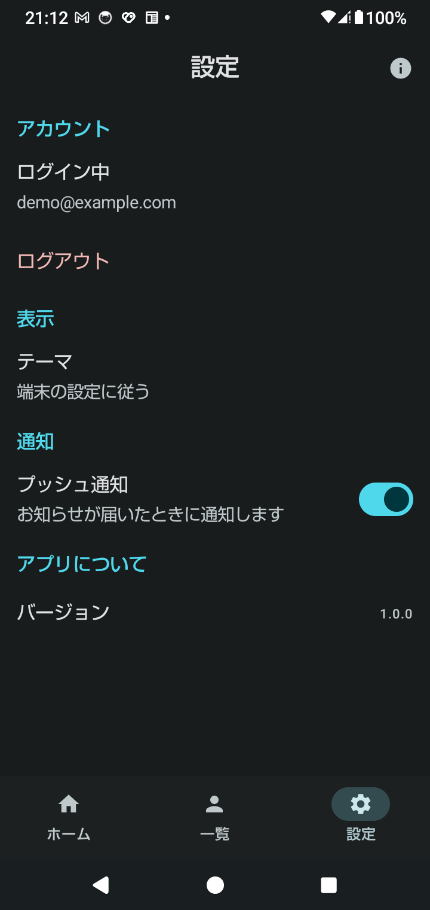
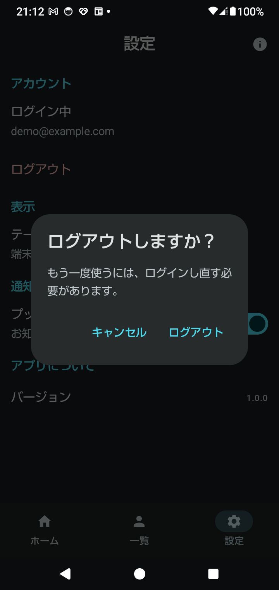

← 前: [07-起動から表示までの流れ.md](07-起動から表示までの流れ.md) ｜ [目次に戻る](../03-Compose画面設計解説.md)

---

## Step 7：入力フォームとログイン画面（`TextField`・入力チェック・送信中）

Phase 2 の最後に、**入力フォーム**を作ります。題材は、固定値で判定するログイン画面です。
ロードマップの「入力フォーム：`TextField`、IME、入力検証。必須入力・形式エラー・送信中を **UI 状態として扱う**」が、
この Step の内容です。Phase 6（ログイン・認証）の手順1も兼ねます。

| 未入力 | 入力エラー | 送信中 | 認証エラー |
|---|---|---|---|
|  |  |  |  |

### 7-1. 何を作ったのか

```
ui/
├─ login/
│   ├─ FakeAuthApi.kt        ← 新規：認証サーバーの代わり（1.5秒待って、固定値と比べる）
│   ├─ LoginValidation.kt    ← 新規：入力チェック（空か、形が正しいか）
│   └─ LoginScreen.kt        ← 新規：状態を持つ LoginScreen と、表示だけの LoginForm
├─ XrStudyApp.kt             ← ログイン済みかどうかで、ログイン画面とメインの画面を切り替える
└─ settings/SettingsScreen.kt ← 「アカウント」欄と、ログアウトの確認ダイアログ
```

| 操作 | 何が起きるか |
|---|---|
| アプリを起動する | ログイン画面が出る（下部ナビは無い） |
| 何も入れずに「ログイン」 | 2つの欄が赤くなり、「〜を入力してください」 |
| `demo@` と `pass` を入れる | 「形式が正しくありません」「8文字以上で入力してください」 |
| 形は正しいが、パスワードが違う | 「ログイン中…」が1.5秒 → 「メールアドレスまたはパスワードが違います」 |
| `demo@example.com` / `password123` | ホーム画面へ。「戻る」を押しても、ログイン画面には戻らない |
| 設定 → ログアウト → 「ログアウト」 | 確認のあと、ログイン画面へ |

練習用のアカウントは、ログイン画面に表示しています。

### 7-2. ログイン画面は、NavHost の宛先にせず、`if` で切り替える

```kotlin
var loggedInEmail by rememberSaveable { mutableStateOf<String?>(null) }

val email = loggedInEmail
if (email == null) {
    LoginScaffold(onLoginSuccess = { loggedInEmail = it })
} else {
    MainScaffold(loggedInEmail = email, onLogout = { loggedInEmail = null }, …)
}
```

ログイン画面を、`LoginRoute` のような NavHost の宛先にすることもできます。ただし、その場合、
ログイン後に「戻る」を押すと、**ログイン画面に戻れてしまいます**。防ぐには、移動するときに
`popUpTo(LoginRoute) { inclusive = true }` で、バックスタックから消す処理を、自分で書く必要があります。

`if` で切り替えると、ログイン画面は**組み立てから外れる**ので、戻る先にそもそも存在しません。
ログアウトしたときも、`MainScaffold` ごと外れるので、`NavController` も作り直され、
開いていた画面やタブの状態が残りません（前の人の画面が、次の人に見えない）。

#### 「ログインしているか」を Boolean で持たない

`isLoggedIn: Boolean` と `email: String` を別に持つと、「ログイン済みなのに、メールアドレスが無い」という、
**ありえない組み合わせ**が書けてしまいます。`String?` の1つにすれば、null かどうかが「ログインしているか」になり、
2つが食い違うことはありません。Step 5 の `UsersUiState` を、Boolean ではなく型で表したのと同じ考え方です。

#### ⚠️ アプリを終了すると、ログアウトする

`rememberSaveable` なので、回転しても残りますが、アプリを終了すると消えます。
「戻る」でアプリを閉じてから起動し直すと、ログイン画面に戻ります。
ログイン状態を保つのは、Phase 6 で、認証 SDK（Firebase Authentication）に任せます。

### 7-3. `TextField` — 値は、自分で持って、渡す

```kotlin
var email by rememberSaveable { mutableStateOf("") }

OutlinedTextField(
    value = email,                  // 表示する値
    onValueChange = { email = it }, // 打たれたら、呼ばれる。ここで値を更新する
    label = { Text("メールアドレス") },
)
```

`TextField` は、**入力された文字を、自分では覚えません**。打たれると `onValueChange` で知らせるだけで、
表示するのは `value` に渡された値です。`onValueChange` で `email` を更新し忘れると、**何を打っても、欄が空のまま**になります（課題1）。

SwiftUI の `TextField("…", text: $email)` は、`@Binding` で、読み書きを1つにまとめています。
Compose では、読み（`value`）と書き（`onValueChange`）を、別々に渡します。
手間は増えますが、「打たれた文字を、そのまま入れるか」を、ここで決められます
（例：数字以外を捨てる、最大文字数で切る）。

`TextField`（塗りつぶし）と `OutlinedTextField`（枠線）は、見た目が違うだけで、使い方は同じです。

### 7-4. キーボード（IME）— 種類と、右下のボタン

```kotlin
keyboardOptions = KeyboardOptions(
    keyboardType = KeyboardType.Email,  // @ が最初から並ぶキーボード
    imeAction = ImeAction.Next,         // 右下が「次へ」。押すと、次の入力欄へ移る
    autoCorrectEnabled = false,         // メールアドレスを、勝手に直させない
),
```

パスワード欄は `KeyboardType.Password` と `ImeAction.Done` にして、「完了」で、ログインボタンと同じことをします。

```kotlin
keyboardActions = KeyboardActions(onDone = { submit() }),
```

`submit()` の中で `focusManager.clearFocus()` を呼び、入力欄からフォーカスを外して、**キーボードを閉じます**。
閉じないと、送信中のくるくるや、エラーのメッセージが、キーボードの裏に隠れます。

#### ⚠️ キーボードに、画面が隠れる — `imePadding`

`MainActivity` で `enableEdgeToEdge()` を呼んでいるので、キーボードが出ても、**画面は縮みません**。
そのままだと、下の入力欄やボタンが、キーボードの裏に隠れます。

```kotlin
LoginScreen(
    modifier = Modifier
        .padding(innerPadding)
        .consumeWindowInsets(innerPadding)  // innerPadding で空けた分を、二重に空けない
        .imePadding(),                      // キーボードの分だけ、下に余白を空ける
)
```

さらに、フォームを `verticalScroll` にしているので、キーボードで狭くなっても、スクロールすれば、ボタンまで届きます。

### 7-5. 入力チェック — いつ、何を出すか

#### 入力チェックの結果は、状態として持たない

```kotlin
val emailError = validateEmail(email)        // 毎回、入力から計算する
val passwordError = validatePassword(password)
```

`var emailError by remember { … }` のように別に持つと、入力が変わったときに、計算し直し忘れて、
表示がずれます。**入力から求められるものは、持たずに、計算する**のが原則です。

`validateEmail` は、Compose を使わない、ただの関数にしています（`LoginValidation.kt`）。
画面を動かさずに、単体テストで確かめられます。

#### 最初の「ログイン」を押すまでは、エラーを出さない

開いた瞬間に「メールアドレスを入力してください」と赤く出ると、まだ何もしていないのに、怒られている気分になります。
そこで、`showFieldErrors` を、最初の「ログイン」で `true` にします。
一度押した後は、入力するたびに、エラーが出たり消えたりします（直したことが、すぐ分かる）。

| 何も入れずに「ログイン」 | 打ち直している途中 |
|---|---|
|  |  |

#### `isError` と `supportingText` はセットで使う

```kotlin
isError = emailError != null,
supportingText = emailError?.let { { Text(it) } },
```

`isError` だけだと、枠が赤くなるだけで、**何が悪いのか分かりません**。赤と他の色の区別がつきにくい人もいます。
メッセージは「形式が正しくありません（例：name@example.com）」のように、**どう直せばよいか**まで書きます。

パスワード欄は、エラーが無いときも、`supportingText` に「8文字以上」を出しています。条件は、間違える前に見せておきます。

#### メールアドレスの形のチェックは、ゆるくする

`@` の前後に文字があり、`@` の後ろに `.` がある、だけを見ています。
メールアドレスの正式な規則はとても複雑で、厳しく書くと、**正しいアドレスまで弾いて**しまいます。
本当に届くアドレスかどうかは、確認メールを送るなど、別の方法で確かめるものです。

### 7-6. 送信中 — 二重送信を防ぎ、回転しても続ける

```kotlin
var isSubmitting by rememberSaveable { mutableStateOf(false) }

LaunchedEffect(isSubmitting) {
    if (!isSubmitting) return@LaunchedEffect
    try {
        FakeAuthApi.login(email.trim(), password)
        currentOnLoginSuccess(email.trim())
    } catch (e: AuthException) {
        authError = e.message
        isSubmitting = false
    }
}
```

送信中は、入力欄とボタンを `enabled = false` にします。押せなければ、**二重に送られません**。
ボタンの中は「くるくる＋ログイン中…」に変えますが、**ボタンの大きさは変えません**（押す場所が動かない）。

#### ★ 「押したら送る」ではなく、「送信中なら、送る」と書く

Step 6 の Snackbar では、押したときに `scope.launch { … }` で処理を始めました。
同じ書き方で送信すると、**送信中に画面を回転させたとき**、処理はキャンセルされ、
`isSubmitting` は `true` のまま残り、**くるくるが永遠に回り続けます**。

`LaunchedEffect(isSubmitting)` で「状態が送信中なら、送信する」と書くと、回転後に組み立て直されたとき、
`isSubmitting` は `rememberSaveable` で `true` のままなので、**もう一度、送信が始まります**。実機のログです。

```
[Login] 送信開始
MainActivity onDestroy          ← 送信中に回転
MainActivity onCreate
[Compose] LoginScreen
[Login] 送信開始                ← 回転後に、やり直している
[Login] 成功
```

「何をしているか」を状態に持ち、**状態から処理を始める**と、Activity が作り直されても、続きから動けます。
（本来は、送信そのものを、回転で止まらない ViewModel に置きます。Phase 3 で扱います）

#### `rememberUpdatedState` — あとから呼ぶ関数は、包んでおく

`LaunchedEffect` の中の処理は、1.5秒後に `onLoginSuccess` を呼びます。その間に親が組み立て直されて、
新しい `onLoginSuccess` が渡されても、`LaunchedEffect` は始めた時点の、**古い関数を握ったまま**です。
`rememberUpdatedState` で包むと、呼ぶ瞬間の、最新の関数を使えます。

### 7-7. 認証のエラー — 分けて伝えず、読み上げる

「メールアドレスが登録されていません」「パスワードが違います」と分けて伝えると、
**「このメールアドレスは登録されている」ことを、他人に教えて**しまいます。そのため、まとめて
「メールアドレスまたはパスワードが違います」と出します。

エラーの欄には `liveRegion` を付けています。

```kotlin
modifier = Modifier.semantics { liveRegion = LiveRegionMode.Polite }
```

表示された瞬間に、TalkBack が読み上げます。付けないと、画面が見えない人は、ボタンを押した後に何が起きたか分かりません。

入力を直し始めたら（`onEmailChange` / `onPasswordChange`）、前回の「違います」は消します。

### 7-8. パスワード欄

```kotlin
visualTransformation = if (passwordVisible) VisualTransformation.None else PasswordVisualTransformation(),
```

`PasswordVisualTransformation` は、**見た目だけ**を「•」にします。`password` の中身は、打った文字のままです。
右の「表示」で、打った文字を確かめられます。押し間違いの多いスマートフォンでは、あると助かる機能です。

#### 自動入力（パスワードマネージャー）に、欄の役割を伝える

```kotlin
modifier = Modifier.semantics { contentType = ContentType.Username }   // パスワード欄は ContentType.Password
```

これだけで、Google パスワード マネージャーなどが、「ここはユーザー名の欄」と分かります。
実機では、ログインに成功した後に、**パスワードを保存するか**を聞いてきました。保存すれば、次回から自動で入ります。



> 練習用のダミーのアカウントなので、保存はしていません（「戻る」で閉じました）。

#### ⚠️ 本物のアプリでは、パスワードをアプリの中に書かない

`FakeAuthApi` には、練習用のパスワードを書いています。本物のアプリでは、**絶対に書いてはいけません**。
アプリのファイルは、誰でも取り出して読めます。パスワードを確かめるのは、サーバー（認証基盤）の役目です（Phase 6）。

### 7-9. ログアウト — 確認してから

| 設定画面 | 確認のダイアログ |
|---|---|
|  |  |

押し間違えると、ログイン画面に戻され、入力し直しになるので、確認のダイアログを出します。
ボタンの文字は「OK」ではなく「**ログアウト**」にしています。ボタンだけ読んでも、何が起きるか分かる文字にします。

「ログアウト」の文字は、`colorScheme.error` の色にして、他の行と区別しています。

### 7-10. 実機で確認した結果

実機（SH-51C・Android 14、ダークモード）で確認しました。

| 確認したこと | 結果 |
|---|---|
| 空のまま「ログイン」 | 2つの欄に「〜を入力してください」 |
| `demo@` / `pass` | 「形式が正しくありません」「8文字以上で入力してください」 |
| メール欄で、キーボードの種類 | `@` のある英字のキーボードが開く。右下は「次へ」 |
| パスワード欄で、右下のキー | 「✓（完了）」。押すと送信し、キーボードが閉じる |
| 違うパスワード | 「ログイン中…」が約1.5秒 → 認証エラー |
| 正しいパスワード | ホーム画面へ。Google パスワード マネージャーが保存を提案 |
| ログイン後に回転 | ログインしたまま |
| ログイン後に「戻る」 | アプリが閉じる（ログイン画面に戻らない） |
| 送信中に回転 | 回転後に送信をやり直し、ログインに成功（7-6 のログ） |
| 設定 → ログアウト | 確認のあと、ログイン画面へ |

### 7-11. iOS との比較

| やりたいこと | SwiftUI | Compose |
|---|---|---|
| 入力欄 | `TextField("…", text: $email)` | `TextField(value = email, onValueChange = { email = it })` |
| パスワード欄 | `SecureField` | `TextField` + `PasswordVisualTransformation` |
| キーボードの種類 | `.keyboardType(.emailAddress)` | `KeyboardOptions(keyboardType = KeyboardType.Email)` |
| 右下のボタン | `.submitLabel(.next)` / `.onSubmit { }` | `ImeAction.Next` / `KeyboardActions(onDone = { })` |
| 次の欄へ移る | `@FocusState` を自分で切り替える | `ImeAction.Next` だけで、自動で移る |
| キーボードを閉じる | `focused = nil` | `focusManager.clearFocus()` |
| 自動入力 | `.textContentType(.username)` | `semantics { contentType = ContentType.Username }` |
| キーボードを避ける | 自動（SwiftUI が避けてくれる） | `imePadding()`（edge-to-edge のとき） |

---

## 手を動かして確かめる（Step 7）

### 課題1：`onValueChange` で値を更新しない（5分）※戻すこと

`LoginScreen.kt` の `onEmailChange` の中の `email = it` をコメントにして、実行します。
メールアドレスの欄に、**何を打っても、空のまま**になることを確認してください。
`TextField` は、自分では文字を覚えない（7-3）ことが分かります。確認したら、元に戻してください。

### 課題2：最初からエラーを出す（5分）※戻すこと

`showFieldErrors` の初期値を `true` にします。開いた瞬間に、赤いエラーが2つ出ることを確認します。
どちらが使いやすいか、考えてみてください。確認したら、元に戻してください。

### 課題3：キーボードの種類を変える（5分）※戻すこと

メール欄の `KeyboardType.Email` を `KeyboardType.Number` に変えます。数字のキーボードが開き、
`@` が打てなくなることを確認します。確認したら、元に戻してください。

### 課題4：`imePadding` を外す（5分）※戻すこと

`XrStudyApp.kt` の `LoginScaffold` から `.imePadding()` を外します。
パスワード欄をタップしてキーボードを出し、**スクロールしても、ログインボタンがキーボードの裏から出てこない**ことを確認します。
確認したら、元に戻してください。

### 課題5：送信中に回転する（5分）

`adb logcat -s LIFECYCLE` を見ながら、正しいアカウントで「ログイン」を押し、「ログイン中…」の間に、画面を回転させます。
`[Login] 送信開始` が2回出て、`[Login] 成功` になることを確認します（7-6）。

### 課題6：「送信中なら、送る」を「押したら送る」に変える（15分）※戻すこと

`LaunchedEffect(isSubmitting) { … }` を消し、`onSubmit` の中で、`rememberCoroutineScope()` の `launch { … }` を使って
送信するように書き換えます。課題5と同じく、送信中に回転させて、
**くるくるが回り続ける**（`[Login] 成功` が出ない）ことを確認してください。確認したら、元に戻してください。

### 課題7：入力チェックに条件を足す（10分）

`validatePassword` に、「英字と数字の両方を含む」という条件を足します。
`password` だけ（数字なし）では、エラーになることを確認します。
Preview の「入力エラー」も、合わせて確認してください。

---

← 前: [07-起動から表示までの流れ.md](07-起動から表示までの流れ.md) ｜ [目次に戻る](../03-Compose画面設計解説.md)
